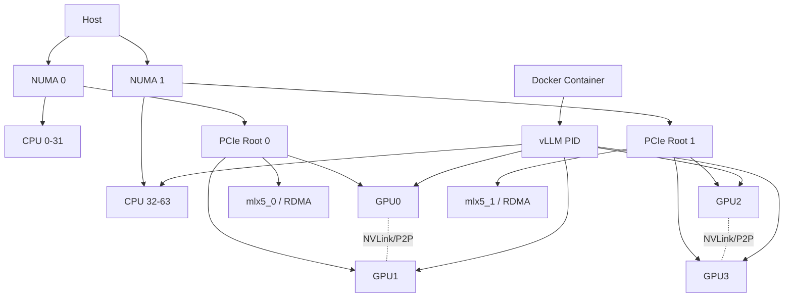

# AIStat V0.1 项目计划书

## Executive Summary

**AIStat** 是一个面向 AI Infra 工程师、Linux 系统工程师与大模型部署人员的轻量级 NVIDIA AI Compute Node 检查工具。V0.1 的目标不是做传统监控，而是让工程师 SSH 到一台陌生 NVIDIA Linux 服务器后，通过一个单二进制命令，快速建立从 **CPU / NUMA / PCIe / GPU / NIC / RDMA / Storage，到 Driver / CUDA / NCCL / Docker / NVIDIA Container Toolkit，再到 PyTorch / vLLM / SGLang** 的完整节点基线。

AIStat 的核心不是“把 `nvidia-smi`、`lspci`、`docker info` 拼起来”，而是完成 **Facts → Relationships → Runtime Context → Rules → Engineering Judgment**：不仅告诉用户机器有什么，还判断这些层是否彼此匹配、是否存在部署阻塞项、是否存在明显性能风险，并为每个 Finding 给出证据、原因、建议和验证方法。

V0.1 固定为 **Linux + NVIDIA、单节点、只读、CLI-first、Native-first、Single Binary、默认无网络访问**。V0.1 不做长期监控、不自动修改主机、不运行 NCCL/nvbandwidth benchmark、不做 Kubernetes/Slurm、多节点和多厂商；这些能力在后续阶段建立在 V0.1 的统一数据模型、拓扑图和 Rule Engine 之上。

> **AIStat V0.1 = Node Stack Inventory + Topology + Runtime Context + Evidence-based Rules + Explainable Findings**

> **核心理念：Know the node before you tune it.**

## 产品定义与范围

### 产品定位

AIStat 的正式定位：

> **AIStat is a lightweight, read-only AI infrastructure inspection and performance-readiness tool for Linux NVIDIA compute nodes.**

中文：

> **AIStat 是一个轻量级、只读的 NVIDIA AI Compute Node 全栈检查工具，用于建立硬件、Linux、NVIDIA CUDA 软件栈、Container 与 AI Runtime 的统一节点画像，并使用基于证据和 workload context 的规则检查部署完整性与性能准备状态。**

目标用户是：

| 用户 | 典型场景 |
|---|---|
| AI Infra Engineer | 接手新 GPU 节点，确认环境、拓扑、CUDA、Docker、Runtime 是否正常 |
| LLM Serving Engineer | 部署 vLLM/SGLang 前检查 GPU、CUDA、Container、TP 拓扑 |
| Systems/Performance Engineer | 分析 NUMA、PCIe、GPU-NIC locality、RDMA 等性能条件 |
| SRE / Platform Engineer | 建立 GPU Server 标准化交付 checklist |
| 开源开发者 | 添加 Collector、Runtime Adapter、Rule |
| Codex / Coding Agent | 基于稳定架构、contract、fixture 和规则规范进行开发 |

### AIStat 要回答的问题

当用户执行：

```bash
aistat
```

V0.1 应尽可能回答：

```text
这是什么机器？

CPU / NUMA / Memory 是什么结构？
GPU 安装在哪里？
GPU 与 GPU 如何连接？
GPU 属于哪个 NUMA？
GPU 与 NIC/RDMA 的 PCIe locality 如何？
PCIe 链路是否存在明显异常？

NVIDIA Driver 是否工作？
Driver 能支持什么 CUDA？
机器安装了哪些 CUDA Toolkit？
NCCL 是否存在？
Docker 是否可用？
NVIDIA Container Toolkit 是否存在并配置？
PyTorch 能否看到 CUDA？

当前是否有 vLLM / SGLang？
这些进程使用了哪些 GPU？
TP/DP/PP 是什么？
进程 CPU affinity 在哪里？
Container 给了哪些 CPU / Memory / GPU？
这些资源和真实硬件拓扑是否匹配？

有没有部署阻塞项？
有没有高置信度的性能风险？
为什么？
证据是什么？
怎么修？
怎么验证？
```

### 全栈范围

AIStat V0.1 将一台 AI Node 建模为六层：

```text
┌──────────────────────────────────────────────────┐
│ AI Runtime                                       │
│ PyTorch / vLLM / SGLang / Process / Environment  │
├──────────────────────────────────────────────────┤
│ Container                                        │
│ Docker / cgroup / cpuset / shm / memlock / GPU   │
├──────────────────────────────────────────────────┤
│ NVIDIA Software Stack                            │
│ Driver / CUDA / NCCL / NVIDIA Container Toolkit  │
├──────────────────────────────────────────────────┤
│ Linux                                            │
│ Kernel / CPU Policy / Memory / limits / sysctl   │
├──────────────────────────────────────────────────┤
│ Fabric / I/O                                     │
│ PCIe / NVLink / NIC / RDMA / NVMe / Storage      │
├──────────────────────────────────────────────────┤
│ Hardware                                         │
│ CPU / Socket / NUMA / RAM / NVIDIA GPU            │
└──────────────────────────────────────────────────┘
```

其中 NVIDIA 官方当前明确区分 Driver、CUDA Toolkit 与 CUDA runtime compatibility；从 CUDA 11 起 Toolkit 内组件也各自独立版本化，因此 AIStat 必须避免把 `nvidia-smi` 中展示的 CUDA capability 简化成“机器 CUDA 版本”。截至 2026 年 8 月 13 日，CUDA 13.3 Update 1 是正式 CUDA Toolkit 文档当前版本，而 CUDA 13.4 仍处在 Developer Preview。citeturn18search1turn18search6

### V0.1 明确包含

V0.1 功能冻结为：

```text
Linux Host Inventory
CPU / NUMA / Memory
PCIe topology
NVIDIA GPU inventory
GPU ↔ GPU topology
GPU ↔ NUMA
GPU ↔ NIC/RDMA
Storage inventory

NVIDIA Driver
CUDA Driver capability
CUDA Toolkit detection
NCCL detection
NVIDIA Container Toolkit

Docker
cgroup
cpuset
/dev/shm
memlock
GPU device visibility

Process discovery
PyTorch
vLLM
SGLang

Normalized Model
Topology Graph
Rule Engine
Deployment Readiness
Performance Readiness
Explainable Findings
Human CLI
JSON API
```

### V0.1 明确不包含

以下能力**不得进入 V0.1 scope**：

| 能力 | V0.1 |
|---|---|
| 常驻 daemon | 不做 |
| 长期 GPU telemetry | 不做 |
| Prometheus exporter | 不做 |
| Grafana Dashboard | 不做 |
| eBPF profiling | 不做 |
| 自动修改 sysctl | 不做 |
| 自动绑核/绑 NUMA | 不做 |
| 自动修改 GPU Power/Clock | 不做 |
| 自动修改 Docker | 不做 |
| 自动调整 vLLM/SGLang | 不做 |
| NCCL benchmark | 不做 |
| nvbandwidth benchmark | 不做 |
| fio benchmark | 不做 |
| Kubernetes | 不做 |
| Slurm | 不做 |
| 多节点拓扑 | 不做 |
| AMD GPU | 不做 |
| Intel GPU | 不做 |
| Ascend NPU | 不做 |

DCGM、NCCL Tests、nvbandwidth 等可以被**检测为 Optional Capability**，但不是 V0.1 强制依赖。

### 核心设计原则

**Native-first。** 优先读取 Linux `/proc`、`/sys`、cgroup 等原生接口，其次调用 Linux/NVIDIA/Docker 官方工具。Linux PCI sysfs 本身提供 PCI device resource/topology 信息；cgroup v2 则提供 effective CPU 和 memory-node assignments。citeturn16search10turn5search1

```text
Linux /proc /sys / cgroup
            ↓
Linux system utilities
            ↓
NVIDIA official CLI
            ↓
Docker official CLI
            ↓
Runtime-specific inspection
            ↓
Optional external diagnostics
```

**Evidence-first。**

```text
事实
↓
关系
↓
上下文
↓
规则
↓
判断
↓
建议
```

禁止：

```text
AI says your NUMA configuration is bad.
```

允许：

```text
GPU0 NUMA = 0
Process CPUs = 32-63
CPU 32-63 ∈ NUMA1
因此该进程没有 GPU0-local CPU 可执行
→ NUMA001 WARN
```

**Read-only-first。** V0.1 不修改主机状态。

**Workload-aware。** THP、CPU governor、NUMA balancing 等很多 Linux 设置不是存在唯一的“AI 最佳值”；Linux 官方文档本身也显示 THP 具有多种策略，而 `intel_pstate` 下的 `powersave` 语义不能简单等同于通用 governor 的最低性能模式。因此 V0.1 不应根据单个配置值武断判 FAIL。citeturn6search0turn5search6

**Missing ≠ Fail。**

例如：

```text
NVIDIA Container Toolkit
Detected: false
```

是 Fact。

只有检测到：

```text
profile = llm-inference
Docker deployment context = true
GPU required = true
```

Rule 才将其转为：

```text
CTR002 FAIL
```

NVIDIA 官方 Container Toolkit 正是用于 GPU accelerated container workflow，并提供 `nvidia-ctk runtime configure --runtime=docker` 等 Docker 配置机制。citeturn0search13turn0search2

### Readiness 不采用虚假总分

V0.1 **不输出 `83/100` 之类主观总分**。

采用两个独立维度：

```text
Deployment Readiness
READY / NOT READY / UNKNOWN

Performance Readiness
READY / WARN / UNKNOWN
```

以及：

```text
FAIL     1
WARN     3
INFO     4
UNKNOWN  1
```

原因是：

```text
Driver 不工作
```

和：

```text
TP GPU grouping 可能不是最优
```

不是同一种问题，不能简单用权重加成一个百分制。

## 功能规格与必采字段

### Fact 状态模型

“必采”不表示每台机器都必须能得到值，而表示该字段必须在 Schema 中有明确状态。

```text
AVAILABLE
NOT_DETECTED
UNSUPPORTED
PERMISSION_DENIED
TIMEOUT
PARSE_ERROR
UNKNOWN
```

因此：

```json
{
  "field": "gpu.0.numa_node",
  "state": "unknown",
  "reason": "kernel returned -1"
}
```

优于字段直接消失。

表中：

- **是**：V0.1 Schema 必须存在；
- **条件**：检测到该 capability/runtime 时必须存在；
- **否**：增强字段，可以缺省。

### 必采字段清单

| 模块 | 字段名 | 来源路径 / Interface | 类型 | 是否必需 | Notes |
|---|---|---|---|---|---|
| Meta | `schema_version` | AIStat | string | 是 | JSON Schema 版本 |
| Meta | `aistat_version` | build info | string | 是 | CLI 版本 |
| Meta | `collected_at` | system clock | timestamp | 是 | UTC + timezone-aware |
| Meta | `profile` | CLI/default | string | 是 | 默认 `llm-inference` |
| Host | `hostname` | `uname/gethostname` | string | 是 | 本地输出允许；未来 support bundle 可 redact |
| Host | `architecture` | `uname` | enum | 是 | `amd64/arm64` |
| Host | `kernel.release` | `uname` | string | 是 | Linux only |
| Host | `os.id` | `/etc/os-release` | string | 是 | distro |
| Host | `os.version` | `/etc/os-release` | string | 是 | distro version |
| Host | `virtualization` | `/proc`, `/sys`, DMI best-effort | enum | 条件 | bare metal / VM / container / unknown |
| CPU | `cpu.vendor` | `/proc/cpuinfo`, sysfs | string | 是 | |
| CPU | `cpu.model` | `/proc/cpuinfo` | string | 是 | |
| CPU | `cpu.logical_count` | `/sys/devices/system/cpu` | int | 是 | |
| CPU | `cpu.socket_count` | CPU topology sysfs | int | 是 | |
| CPU | `cpu.core_count` | CPU topology sysfs | int | 是 | |
| CPU | `cpu.smt` | CPU topology | bool | 是 | |
| CPU | `cpu.logical[].id` | sysfs | int | 是 | |
| CPU | `cpu.logical[].package_id` | CPU topology sysfs | int | 是 | |
| CPU | `cpu.logical[].core_id` | CPU topology sysfs | int | 是 | |
| CPU | `cpu.logical[].numa_node` | NUMA sysfs | int | 是 | |
| CPU | `cpu.cpufreq.driver` | `/sys/devices/system/cpu/cpufreq` | string | 条件 | 不做武断 governor rule |
| CPU | `cpu.cpufreq.governor` | cpufreq sysfs | string | 条件 | Linux CPUFreq 提供 scaling policy/governor 接口。citeturn5search2turn5search6 |
| NUMA | `numa.node_count` | `/sys/devices/system/node` | int | 是 | |
| NUMA | `numa.nodes[].id` | node sysfs | int | 是 | |
| NUMA | `numa.nodes[].cpulist` | `node*/cpulist` | cpuset | 是 | |
| NUMA | `numa.nodes[].mem_total` | `node*/meminfo` | bytes | 是 | |
| NUMA | `numa.nodes[].mem_free` | `node*/meminfo` | bytes | 是 | |
| NUMA | `numa.nodes[].distance[]` | `node*/distance` | int[] | 是 | 用于 locality cost |
| Memory | `memory.total` | `/proc/meminfo` | bytes | 是 | Linux proc exposes memory/swap data. citeturn6search5 |
| Memory | `memory.available` | `/proc/meminfo` | bytes | 是 | |
| Memory | `memory.swap_total` | `/proc/meminfo` | bytes | 是 | |
| Memory | `memory.swap_free` | `/proc/meminfo` | bytes | 是 | |
| Memory | `memory.thp.mode` | `/sys/kernel/mm/transparent_hugepage/*` | enum | 是 | collect only; no unconditional FAIL. citeturn6search0 |
| Memory | `memory.hugepages.size` | `/proc/meminfo` / node meminfo | bytes | 是 | HugeTLB 可按系统和 NUMA node 观察。citeturn5search3 |
| Memory | `memory.hugepages.total/free` | proc/sysfs | int | 是 | |
| Memory | `memory.numa_balancing` | `/proc/sys/kernel/numa_balancing` | bool | 是 | 不直接做高置信度 FAIL |
| Limits | `limits.memlock.soft` | `getrlimit` / process limits | bytes/unlimited | 是 | NCCL/RDMA Rule 输入 |
| Limits | `limits.memlock.hard` | same | bytes/unlimited | 是 | NCCL 官方明确指出 IB pinned-memory registration 可能受到 memlock 约束。citeturn17search1 |
| PCIe | `pci.devices[].bdf` | `/sys/bus/pci/devices` | BDF | 是 | PCI sysfs 是 primary source。citeturn16search10 |
| PCIe | `pci.devices[].vendor_id` | PCI sysfs | hex | 是 | |
| PCIe | `pci.devices[].device_id` | PCI sysfs | hex | 是 | |
| PCIe | `pci.devices[].class` | PCI sysfs | hex/enum | 是 | |
| PCIe | `pci.devices[].driver` | sysfs symlink | string | 条件 | |
| PCIe | `pci.devices[].numa_node` | PCI sysfs | int | 是 | `-1` → unknown |
| PCIe | `pci.devices[].parent_bdf` | sysfs hierarchy | BDF | 是 | topology edge |
| PCIe | `pci.devices[].root_id` | derived sysfs hierarchy | string | 是 | |
| PCIe | `pci.devices[].current_link_width` | sysfs / NVIDIA query | int | 条件 | |
| PCIe | `pci.devices[].max_link_width` | sysfs / NVIDIA query | int | 条件 | |
| PCIe | `pci.devices[].current_link_speed` | sysfs / NVIDIA query | GT/s | 条件 | V0.1 收集，但不凭单次 speed snapshot 判 FAIL |
| PCIe | `pci.devices[].max_link_speed` | sysfs / NVIDIA query | GT/s | 条件 | |
| PCIe | `pci.devices[].acs` | `lspci -vv` best-effort | object | 条件 | GDR/P2P rule 使用；ACS 可使 P2P 流量被重定向。citeturn17search3 |
| GPU | `gpus[].index` | `nvidia-smi` | int | 条件 | NVIDIA host 必需 |
| GPU | `gpus[].uuid` | `nvidia-smi` | string | 条件 | 稳定设备 identity |
| GPU | `gpus[].name` | `nvidia-smi` | string | 条件 | |
| GPU | `gpus[].pci_bdf` | `nvidia-smi` + sysfs | BDF | 条件 | 用于关联 PCI graph |
| GPU | `gpus[].memory_total` | `nvidia-smi` | bytes | 条件 | |
| GPU | `gpus[].driver_version` | NVIDIA driver | semver-ish | 条件 | |
| GPU | `gpus[].compute_mode` | NVIDIA-SMI/NVML semantics | enum | 条件 | compute mode 是 NVIDIA 可查询状态。citeturn2search2 |
| GPU | `gpus[].persistence_mode` | NVIDIA-SMI | bool | 条件 | |
| GPU | `gpus[].mig.mode` | NVIDIA-SMI | enum | 条件 | |
| GPU | `gpus[].ecc.mode` | NVIDIA-SMI | enum | 条件 | |
| GPU | `gpus[].ecc.uncorrected_volatile` | NVIDIA-SMI/DCGM field | counters | 条件 | DCGM/NVIDIA exposes ECC state/counters. citeturn2search5 |
| GPU | `gpus[].bar1_total/used` | NVIDIA-SMI | bytes | 条件 | |
| GPU | `gpus[].power_limit` | NVIDIA-SMI | watts | 条件 | |
| GPU | `gpus[].default_power_limit` | NVIDIA-SMI/NVML | watts | 条件 | current/default power limits are queryable. citeturn2search2 |
| GPU | `gpus[].temperature` | NVIDIA-SMI | °C | 条件 | snapshot only |
| GPU | `gpus[].utilization` | NVIDIA-SMI | percent | 条件 | snapshot only；V0.1 非 monitor |
| GPU Topology | `gpu_topology.matrix` | `nvidia-smi topo -m` | matrix | 条件 | GPU-GPU locality |
| GPU Topology | `gpu_p2p.matrix` | `nvidia-smi topo -p2p` | matrix | 条件 | NCCL troubleshooting uses NVIDIA topology/P2P checks. citeturn0search1 |
| XID | `nvidia.xids[]` | kernel journal / dmesg best-effort | event[] | 条件 | NVIDIA Xid 来自 driver error report，通常进入 OS/kernel log。citeturn2search1turn2search9 |
| NIC | `network.interfaces[].name` | `/sys/class/net` | string | 是 | |
| NIC | `network.interfaces[].oper_state` | sysfs | enum | 是 | |
| NIC | `network.interfaces[].carrier` | sysfs | bool | 条件 | |
| NIC | `network.interfaces[].speed` | sysfs / `ethtool` | Mbps | 条件 | |
| NIC | `network.interfaces[].mtu` | sysfs | int | 是 | |
| NIC | `network.interfaces[].driver` | sysfs | string | 条件 | |
| NIC | `network.interfaces[].pci_bdf` | sysfs symlink | BDF | 条件 | |
| NIC | `network.interfaces[].numa_node` | associated PCI device | int | 条件 | |
| RDMA | `rdma.devices[].name` | `/sys/class/infiniband`, `rdma dev` | string | 条件 | `rdma dev` 可查询 RDMA device state。citeturn15search0 |
| RDMA | `rdma.devices[].ports[].state` | sysfs / `rdma` | enum | 条件 | |
| RDMA | `rdma.devices[].ports[].link_layer` | sysfs/RDMA tools | enum | 条件 | InfiniBand/RoCE |
| RDMA | `rdma.devices[].netdev` | sysfs / `ibdev2netdev` | string | 条件 | NVIDIA examples use this mapping. citeturn15search7 |
| RDMA | `rdma.devices[].pci_bdf` | sysfs | BDF | 条件 | GPU↔NIC topology |
| Storage | `storage.devices[].name` | sysfs | string | 是 | inventory only |
| Storage | `storage.devices[].size` | sysfs | bytes | 是 | |
| Storage | `storage.devices[].rotational` | sysfs | bool | 条件 | |
| Storage | `storage.mounts[].filesystem` | mountinfo | string | 是 | |
| Storage | `storage.mounts[].mount_point` | mountinfo | path | 是 | 默认显示可做 path redaction |
| Storage | `storage.mounts[].available` | statfs | bytes | 是 | |
| Storage | `storage.devices[].pci_bdf` | sysfs | BDF | 条件 | NVMe topology |
| NVIDIA Stack | `stack.driver.version` | `/proc/driver/nvidia/version`, SMI | string | 条件 | |
| NVIDIA Stack | `stack.driver.branch` | derived | string | 条件 | lifecycle check |
| NVIDIA Stack | `stack.driver.cuda_major_capability` | NVIDIA support matrix | int | 条件 | R580/R595/R610 support CUDA 13 without forward-compat package; current lifecycle differs by branch. citeturn18search0 |
| CUDA | `stack.cuda.toolkits[]` | `nvcc`, `/usr/local/cuda*`, package metadata | version[] | 条件 | best-effort，不等价于 app runtime |
| CUDA | `stack.cuda.active_runtime` | runtime adapter | version | 条件 | Rule 优先使用真正 active runtime |
| NCCL | `stack.nccl.versions[]` | package/library metadata | version[] | 条件 | |
| NCT | `stack.nvidia_container_toolkit.detected` | package / `nvidia-ctk` | bool | 是 | false 本身不等于 FAIL |
| NCT | `stack.nvidia_container_toolkit.version` | official CLI/package | string | 条件 | 新版 toolkit 不应强制寻找旧的独立 runtime package。citeturn0search24 |
| NCT | `stack.nvidia_container_toolkit.docker_configured` | Docker config + runtime info | bool | 条件 | |
| Optional | `stack.dcgm.detected` | executable/package | bool | 是 | INFO only |
| Optional | `stack.nccl_tests.detected` | executable | bool | 是 | |
| Optional | `stack.nvbandwidth.detected` | executable | bool | 是 | |
| Docker | `docker.detected` | executable/socket | bool | 是 | |
| Docker | `docker.client_version` | Docker CLI | string | 条件 | |
| Docker | `docker.server_version` | `docker version` | string | 条件 | |
| Docker | `docker.daemon_reachable` | Docker API/CLI | bool | 条件 | |
| Docker | `docker.cgroup_version` | `docker info` / `/sys/fs/cgroup` | enum | 条件 | Docker supports resource constraints via cgroups; cgroup v1 is now deprecated and migration to v2 is recommended. citeturn3search0turn3search15 |
| Docker | `docker.rootless` | Docker info/context | bool | 条件 | rootless must not be mistaken for broken daemon. citeturn3search17 |
| Container | `containers[].id` | Docker inspect | string | 条件 | default truncate/hash in exported JSON |
| Container | `containers[].cpuset_cpus` | Docker/cgroup | cpuset | 条件 | Docker supports `--cpuset-cpus`. citeturn3search1 |
| Container | `containers[].cpuset_mems` | Docker/cgroup | nodeset | 条件 | Docker supports NUMA memory-node restriction. citeturn3search1 |
| Container | `containers[].effective_cpus` | cgroup v2 | cpuset | 条件 | prefer `cpuset.cpus.effective`. citeturn5search1 |
| Container | `containers[].effective_mems` | cgroup v2 | nodeset | 条件 | prefer `cpuset.mems.effective`. citeturn5search1 |
| Container | `containers[].cpu_quota` | cgroup/Docker | number | 条件 | |
| Container | `containers[].memory_limit` | cgroup/Docker | bytes/unlimited | 条件 | Docker memory constraints are explicit and otherwise may be unlimited. citeturn3search0turn3search3 |
| Container | `containers[].memory_swap` | cgroup/Docker | bytes | 条件 | |
| Container | `containers[].shm_size` | Docker inspect/statfs | bytes | 条件 | Docker default is 64 MiB when not overridden. citeturn4search0 |
| Container | `containers[].ipc_mode` | Docker inspect | enum | 条件 | |
| Container | `containers[].memlock` | Docker/process limits | object | 条件 | |
| Container | `containers[].gpu_device_requests` | Docker inspect | object[] | 条件 | Docker `--gpus` exposes GPU device requests. citeturn3search1 |
| Process | `processes[].pid` | `/proc/<pid>` | int | 条件 | AI process only |
| Process | `processes[].exe` | `/proc/<pid>/exe` | string | 条件 | basename preferred |
| Process | `processes[].cmdline` | `/proc/<pid>/cmdline` | structured/redacted | 条件 | 不保存无关原始字符串 |
| Process | `processes[].cpus_allowed` | `/proc/<pid>/status` | cpuset | 条件 | |
| Process | `processes[].mems_allowed` | process status/cgroup | nodeset | 条件 | |
| Process | `processes[].cgroup` | `/proc/<pid>/cgroup` | string | 条件 | normalized |
| Process | `processes[].container_id` | derived cgroup/Docker | string | 条件 | |
| Process | `processes[].env` | `/proc/<pid>/environ` exact allowlist | map | 条件 | 永远禁止 wildcard dump |
| PyTorch | `pytorch.version` | process interpreter probe | string | 条件 | |
| PyTorch | `pytorch.cuda_build` | `torch.version.cuda` | string/null | 条件 | 不和本机 Toolkit 简单比较 |
| PyTorch | `pytorch.cuda_available` | `torch.cuda.is_available()` | bool | 条件 | PyTorch 官方 API。citeturn8search1 |
| PyTorch | `pytorch.device_count` | `torch.cuda.device_count()` | int | 条件 | PyTorch 官方 API。citeturn8search9 |
| vLLM | `vllm.version` | process environment/package metadata | string | 条件 | |
| vLLM | `vllm.pid` | process detector | int | 条件 | |
| vLLM | `vllm.tp_size` | sanitized argv/config | int | 条件 | vLLM supports tensor parallel/distributed execution. citeturn7search1turn18search12 |
| vLLM | `vllm.pp_size` | sanitized argv/config | int | 条件 | |
| vLLM | `vllm.dp_size` | sanitized argv/config | int | 条件 | version-aware |
| vLLM | `vllm.local_world_size` | adapter-derived | int | 条件 | central Rule input |
| vLLM | `vllm.visible_devices` | exact env allowlist | GPU ref[] | 条件 | CUDA visibility may be controlled via `CUDA_VISIBLE_DEVICES`. citeturn7search17turn8search3 |
| vLLM | `vllm.selected_gpus` | resolved graph refs | GPU ref[] | 条件 | |
| SGLang | `sglang.version` | package metadata | string | 条件 | |
| SGLang | `sglang.tp_size` | sanitized argv | int | 条件 | |
| SGLang | `sglang.dp_size` | sanitized argv | int | 条件 | |
| SGLang | `sglang.local_world_size` | adapter-derived | int | 条件 | |
| SGLang | `sglang.base_gpu_id/gpu_id_step` | sanitized argv | int | 条件 | server adapter |
| SGLang | `sglang.numa_nodes` | sanitized argv | int[] | 条件 | |
| SGLang | `sglang.disaggregation_mode` | sanitized argv | enum | 条件 | |
| SGLang | `sglang.disaggregation_backend` | sanitized argv | enum | 条件 | |
| SGLang | `sglang.disaggregation_ib_devices` | sanitized argv | HCA ref[] | 条件 | official SGLang supports explicit IB-device selection for disaggregation. citeturn19search1turn19search2 |

### 软件版本不是简单字符串列表

AIStat 必须区分：

```text
NVIDIA Driver
CUDA Driver capability
Installed CUDA Toolkit
Active CUDA Runtime
PyTorch CUDA Build
Container CUDA Runtime
```

例如：

```text
NVIDIA Driver             595.x
Driver CUDA Major         13

Installed Toolkit
├── 12.8
└── 13.2

PyTorch CUDA Build
└── 13.0

Active vLLM Container
└── CUDA runtime 13.0
```

NVIDIA 当前文档规定 CUDA 13.x 的 minor-version compatibility 基线为 driver `>=580`，而具体 CUDA Toolkit release 还有对应的 driver version，例如 CUDA 13.0 GA 对应 `>=580.65.06`，CUDA 13.2 GA 对应 `>=595.45.04`，CUDA 13.3 Update 1 对应 `>=610.43.02`；同时兼容包会改变实际 compatibility path，因此 Rule 必须建模 compatibility mode，而不是机械比较两个版本字符串。citeturn18search1turn18search6

截至 2026 年 8 月 13 日，NVIDIA 的 Data Center Driver lifecycle 表列出 R580 LTS 到 2028 年 6 月、R595 Production Branch 到 2027 年 3 月、R610 New Feature Branch 到 2026 年 8 月；R535 的 EOL 已列为 2026 年 6 月。citeturn18search0

### Runtime Detection

AIStat 不扫描全部 Python 环境。

优先顺序：

```text
Running AI process
        ↓
Resolve executable/interpreter
        ↓
Detect runtime
        ↓
Read package metadata
        ↓
Parse known CLI flags
        ↓
Read exact env allowlist
        ↓
Map PID → Container → cgroup → CPU/Memory/GPU
```

例如：

```text
PID 19281
  │
  ├── Runtime: vLLM
  ├── TP: 4
  ├── CPUs: 32-63
  ├── Container: 3ad...
  └── GPUs: GPU0 GPU1 GPU2 GPU3
                   │
                   ▼
              Topology Graph
```

### PyTorch Probe

PyTorch probe 运行在独立、受限时 subprocess 中，只读取：

```python
torch.__version__
torch.version.cuda
torch.cuda.is_available()
torch.cuda.device_count()
```

其中 `torch.cuda.is_available()` 与 `torch.cuda.device_count()` 都是 PyTorch 正式 API。citeturn8search1turn8search9

V0.1 不把 Python/PyTorch 变成 AIStat 自身的 runtime dependency：

```text
Python unavailable
        ↓
PyTorch probe = UNKNOWN
        ↓
AIStat continues
```

当前 PyTorch 2.13 已将 CUDA 13.0 保持为默认 CUDA build，并移除了 2.13 的 CUDA 12.8/12.9 binary builds，这进一步说明 AIStat 的兼容判断应使用实际 framework CUDA build，而不是假设本机 `/usr/local/cuda` 就是框架 runtime。citeturn18search2

## 数据模型、拓扑与 Rule Engine

### 数据流

AIStat 内部必须严格遵守：

```text
Native / Official Sources
          │
          ▼
      Collectors
          │
          ▼
   Normalized Facts
          │
          ▼
   Normalized Snapshot
          │
          ▼
    Topology Graph
          │
          ├──────── Runtime Context
          │
          ▼
      Rule Engine
          │
          ▼
       Findings
          │
    ┌─────┴─────┐
    ▼           ▼
 Human CLI     JSON
```

Collector 禁止直接输出：

```text
Your NUMA configuration is bad.
```

Collector 只能输出：

```text
GPU0.numa_node = 0
PID123.cpus_allowed = 32-63
NUMA1.cpus = 32-63
```

### Fact 模型

推荐：

```go
package model

import "time"

type FactState string

const (
	FactAvailable        FactState = "available"
	FactNotDetected      FactState = "not_detected"
	FactUnsupported      FactState = "unsupported"
	FactPermissionDenied FactState = "permission_denied"
	FactTimeout          FactState = "timeout"
	FactParseError       FactState = "parse_error"
	FactUnknown          FactState = "unknown"
)

type Confidence string

const (
	ConfidenceHigh   Confidence = "high"
	ConfidenceMedium Confidence = "medium"
	ConfidenceLow    Confidence = "low"
)

type EvidenceSource struct {
	Kind    string `json:"kind"`    // sysfs, procfs, command, docker, derived
	Locator string `json:"locator"` // path or sanitized command identity
}

type Fact[T any] struct {
	Value       T              `json:"value,omitempty"`
	State       FactState      `json:"state"`
	Source      EvidenceSource `json:"source"`
	CollectedAt time.Time      `json:"collected_at"`
	Confidence  Confidence     `json:"confidence"`
	Reason      string         `json:"reason,omitempty"`
}
```

### Snapshot

顶层模型建议：

```go
type Snapshot struct {
	Meta       Meta
	Host       Host
	CPU        CPU
	Memory     Memory
	NUMA       NUMA
	PCI        PCI
	GPUs       []GPU
	Network    Network
	RDMA       RDMA
	Storage    Storage

	NVIDIAStack NVIDIAStack
	Docker      DockerState

	Processes []Process
	PyTorch   []PyTorchRuntime
	VLLM      []VLLMRuntime
	SGLang    []SGLangRuntime
}
```

V0.1 不公开稳定 Go SDK，因此这些类型放在：

```text
internal/model
```

Public Go API：

**未指定。**

### Topology Graph

AIStat 最大的长期资产之一是统一拓扑，而不是十几个彼此独立的 Collector 输出。



NVIDIA GPUDirect RDMA 官方文档特别强调 GPU 与 peer device 的 PCIe root-complex relationship；NVIDIA GDS 文档也将 GPU、NIC、Storage 所处的 PCIe switch/root complex 作为性能分析的重要 topology 信息。因此 GPU↔NIC↔PCIe relationship 不是辅助展示，而应该进入统一 graph。citeturn17search0turn17search3turn17search6

### Graph Node

```go
type NodeKind string

const (
	NodeHost       NodeKind = "host"
	NodeNUMA       NodeKind = "numa"
	NodeCPUPackage NodeKind = "cpu_package"
	NodeCPU        NodeKind = "cpu"
	NodePCIRoot    NodeKind = "pci_root"
	NodePCIBridge  NodeKind = "pci_bridge"
	NodeGPU        NodeKind = "gpu"
	NodeNIC        NodeKind = "nic"
	NodeRDMA       NodeKind = "rdma"
	NodeBlock      NodeKind = "block_device"
	NodeContainer  NodeKind = "container"
	NodeProcess    NodeKind = "process"
	NodeSoftware   NodeKind = "software"
)
```

### Graph Edge

```go
type EdgeKind string

const (
	EdgeContains    EdgeKind = "contains"
	EdgeAttachedTo  EdgeKind = "attached_to"
	EdgeLocalTo     EdgeKind = "local_to"
	EdgeConnectedTo EdgeKind = "connected_to"
	EdgePeerToPeer  EdgeKind = "peer_to_peer"
	EdgeRunsIn      EdgeKind = "runs_in"
	EdgeUses        EdgeKind = "uses"
	EdgeVisibleTo   EdgeKind = "visible_to"
	EdgeBoundTo     EdgeKind = "bound_to"
)
```

典型关系：

```text
GPU0 LOCAL_TO NUMA0
GPU0 ATTACHED_TO PCIRoot0

mlx5_0 LOCAL_TO NUMA0
mlx5_0 ATTACHED_TO PCIRoot0

PID123 RUNS_IN ContainerABC
PID123 USES GPU0
PID123 BOUND_TO CPUSET_32_63
```

### Topology Cost

为了支持 Rule，而不是只画树，可以定义离散 cost：

```text
NVLink/NVSwitch     lowest
PIX                 low
PXB                 low-medium
PHB                 medium
NODE                high
SYS                 highest
P2P unsupported     special/high
```

具体权重：

**未指定。**

V0.1 不应公开一个伪精确“拓扑分数”。Rule 只在存在**严格支配关系**时判断，例如：

```text
Current:
GPU0 + GPU4 → SYS

Alternative:
GPU0 + GPU1 → NVLink

并且两组都满足 workload GPU 数量要求
```

才发出 topology warning。

### Rule 的正式定义

> **Rule = 把 Facts、Topology 和 Runtime Context 转化为可解释 AI Infra 工程判断的纯逻辑函数。**

```text
Facts
+
Topology
+
Runtime Context
+
Profile
        │
        ▼
      Rule
        │
        ▼
     Finding
```

### Rule Contract

```go
package rules

type RuleID string

type Rule interface {
	ID() RuleID
	Meta() RuleMeta
	Evaluate(ctx RuleContext) []Finding
}

type RuleContext struct {
	Snapshot *model.Snapshot
	Graph    *topology.Graph
	Profile  profile.Profile
	Now      time.Time
}

type RuleMeta struct {
	Title      string
	Domain     string
	Dimension  Dimension
	Priority   Priority
	Confidence model.Confidence
	References []Reference
}
```

**Rule 不允许 I/O。**

Rule 禁止：

```go
exec.Command("nvidia-smi")
os.ReadFile("/sys/...")
dockerInspect(...)
```

所有事实必须提前进入 Snapshot/Graph。

### Finding Contract

```go
type Status string

const (
	StatusPass    Status = "pass"
	StatusWarn    Status = "warn"
	StatusFail    Status = "fail"
	StatusInfo    Status = "info"
	StatusUnknown Status = "unknown"
	StatusSkip    Status = "skip"
)

type Finding struct {
	RuleID         RuleID
	Status         Status
	Dimension      Dimension
	Confidence     model.Confidence
	Title          string

	CurrentState   string
	ExpectedState  string

	Evidence       []Evidence
	Impact         string
	Recommendation string
	Verification   []VerificationStep
}
```

### UNKNOWN 必须是一等公民

假设：

```text
GPU NUMA information unavailable
```

那么 NUMA Rule 必须：

```text
UNKNOWN
```

禁止：

```text
PASS
```

否则“没查到”会被错误解释成“没问题”。

### SKIP 与 UNKNOWN 区别

```text
UNKNOWN
需要检查，但证据不足

SKIP
当前 context 本来就不适用
```

例如没有 Docker：

```text
CTR002
SKIP
```

而 Docker GPU workload 存在，但无权读 Docker daemon：

```text
CTR002
UNKNOWN
reason = permission denied
```

### Rule 的两个维度

```text
Deployment
Performance
```

例如：

```text
GPU001
Deployment / FAIL

NUMA001
Performance / WARN
```

### Rule Profile

V0.1 内置：

```text
general
llm-inference
```

默认：

```bash
aistat
```

等价于：

```bash
aistat status --profile llm-inference
```

`status` 是运维总览；`check` 保留完整 Finding、证据、建议与验证步骤。

Profile 自定义文件格式：

**未指定。**

V0.1 先将 profile 编译进 binary。

## 首批高置信度规则矩阵

### Rule 设计基线

这 25 条规则有一个刻意的取舍：

**不为了规则数量，把模糊“最佳实践”塞进 V0.1。**

例如以下内容 V0.1 采集，但不进入首批 FAIL/WARN：

```text
THP = always/madvise/never
CPU governor = powersave/performance
NUMA balancing
GPU power limit below default
```

因为这些配置的优劣高度依赖 workload、CPU driver、平台和运行方式。Linux THP 和 CPUFreq/intel_pstate 文档本身已经体现这种上下文差异。citeturn6search0turn5search2turn5search6

优先级：

```text
P0 = Deployment blocker / health-critical
P1 = strong performance/readiness risk
P2 = maintenance/lifecycle/advisory
```

### 首批规则矩阵

| 域 | ID | 标题 | 判定条件 | 证据来源 | 建议 | 验证方法 | 置信度 | 优先级 |
|---|---|---|---|---|---|---|---|---|
| NVIDIA | `GPU001` | NVIDIA device detected but driver unusable | PCI 枚举发现 NVIDIA GPU，但 NVIDIA driver/device interface 不可用，且 `nvidia-smi` 无法正常查询 | PCI sysfs、`/proc/driver/nvidia`、`nvidia-smi`；NVIDIA GPU runtime 需要兼容 driver。citeturn18search1 | 检查 kernel module、driver install、driver/library mismatch、kernel log | `nvidia-smi`；检查 driver module 与 kernel log | 高 | P0 |
| NVIDIA | `GPU002` | GPU compute mode prohibits compute | workload 目标为 CUDA GPU，某被选 GPU 的 compute mode=`PROHIBITED` | NVIDIA-SMI/NVML compute-mode state。citeturn2search2 | 将 workload 换到允许 compute 的 GPU；若配置错误，由管理员修正 compute mode | `nvidia-smi` 重新查询 + 最小 CUDA/PyTorch probe | 高 | P0 |
| NVIDIA | `GPU003` | Volatile uncorrectable ECC errors detected | ECC-capable GPU 的 volatile uncorrectable ECC counter > 0 | NVIDIA/DCGM ECC fields。citeturn2search5turn2search24 | 暂停把该 GPU 作为正常生产设备；检查 Xid、DCGM diagnostics/厂商流程 | 再查 ECC counter、kernel Xid；可选 DCGM diagnostic | 高 | P0 |
| NVIDIA | `GPU004` | Recent critical NVIDIA Xid detected | 指定观察窗内检测到 NVIDIA critical Xid catalog 中的严重事件 | kernel journal/dmesg；Xid 是 NVIDIA driver 写入 OS log 的错误报告。citeturn2search1turn2search9 | 根据 Xid 类型执行 NVIDIA 官方处置；必要时 drain/reboot/硬件检查 | 清除原因后重新跑 workload 并确认无新 Xid | 高 | P0 |
| PCIe | `PCIE001` | Active GPU negotiated below max link width | GPU 正有 compute process/active context，且 current width < max width；不根据 idle speed 单独触发 | NVIDIA PCIe fields/sysfs/DCGM 可提供 current/max width。citeturn2search5turn16search10 | 检查 slot、riser、BIOS、PCIe switch/root path；确认平台设计是否本来限制 lane | workload 活跃时重新查询；必要时平台/vendor hardware test | 高 | P1 |
| PCIe | `PCIE002` | ACS may redirect peer traffic | bare-metal + P2P/GDR context + GPU/NIC 路径相关 PCI bridge 显示 ACS redirect/source validation 风险 | `lspci -vv`；NVIDIA GDS 文档说明 ACS 会使 P2P transaction 经 root complex，影响 latency/throughput。citeturn17search3 | 根据平台/OEM/NVIDIA 指南确认 ACS/IOMMU 设计；禁止 AIStat 自动关闭安全功能 | 变更前后用官方 P2P/NCCL/GDR benchmark 验证 | 高（仅前置条件满足时） | P1 |
| NUMA | `NUMA001` | AI process has no GPU-local CPU | AI process 使用 GPU G，且 `cpus_allowed ∩ CPUs(local NUMA(G)) = ∅` | `/proc/<pid>/status`、NUMA sysfs、GPU PCI NUMA | 将 worker CPU affinity 优先布局到 GPU-local CPUs；保留 workload benchmark 验证 | 相同 workload 前后比较 latency/throughput，并重新执行 AIStat | 高 | P1 |
| NUMA | `NUMA002` | Effective memory nodes exclude GPU-local NUMA | AI process/container 使用 GPU G，且 effective allowed mem nodes 不包含 G 的 NUMA node | cgroup `cpuset.mems.effective`、NUMA/GPU topology；kernel cgroup v2 定义 effective memory-node grants。citeturn5search1 | 调整 cpuset memory placement，使 GPU-local NUMA memory 可用 | 重跑 AIStat + NUMA-aware workload comparison | 高 | P1 |
| Topology | `TOPO001` | Selected multi-GPU group is strictly dominated | TP/多 GPU group 中存在不利 `SYS`/P2P-unavailable pair，同时存在同规模、满足可见性要求且所有关键 pair 更优的 alternative group | `nvidia-smi topo -m` + P2P matrix；NCCL topology troubleshooting uses GPU P2P/topology. citeturn0search1turn17search4 | 优先测试严格更优的 GPU grouping；不自动重排 | 用同模型、同并发、同 batch 比较两组 serving benchmark | 高（严格支配时） | P1 |
| Network | `NET001` | Explicitly selected network device unavailable | runtime/NCCL 显式指定某 NIC/HCA，但设备不存在、port down 或不可用 | sysfs/RDMA state + runtime config；NCCL 会使用网络接口完成 inter-node communication。citeturn17search14 | 修正 interface/HCA selection 或恢复网络设备 | `ip/rdma` 状态 + runtime re-init | 高 | P0 |
| Network | `NET002` | GPUDirect path crosses unsupported PCIe root arrangement | workload 明确要求 GDR，且可确认目标 GPU 与 NIC 不共享 upstream root complex；对无法可靠建模的新平台 SKIP | GPU/NIC PCI topology；NVIDIA GPUDirect RDMA 将 shared upstream PCIe root complex 列为重要限制。citeturn17search0 | 选择更近 NIC/GPU pairing 或依据 OEM 平台 topology 配置 | GDR/NCCL bandwidth test；检查 runtime 是否真正启用 GDR | 高（支持的平台） | P1 |
| Network | `NET003` | RDMA/NCCL memlock constrained | RDMA/IB context 为真，且 effective memlock 明确为有限且不足以满足 pinned-memory workflow | process/container limits；NCCL 文档指出 IB pinned memory registration 可因 memlock 不足失败，并对 Docker 示例使用 unlimited memlock。citeturn17search1 | 按 deployment policy 提高 memlock；AIStat 只给建议不修改 | `ulimit -l`/container limits + NCCL initialization | 高 | P0 |
| NCCL | `NCCL001` | Explicit NCCL interface filter matches no usable device | `NCCL_SOCKET_IFNAME` 或 `NCCL_IB_HCA` 被显式设置，但解析后没有任何有效接口/HCA | exact env allowlist + NIC/RDMA inventory；NCCL 官方定义这两个变量的 interface/HCA filter 语义。citeturn17search2 | 修正变量，或移除不必要 override 让 NCCL 自动选路 | `NCCL_DEBUG=INFO` 启动相同 workload，确认选择有效 NIC/HCA | 高 | P0 |
| CUDA | `CUDA001` | Active CUDA runtime incompatible with driver | 已确定实际 active runtime/framework CUDA build，且按嵌入的 NVIDIA compatibility table 无合法 driver/forward-compat 路径 | driver version、runtime version、compat package、NVIDIA CUDA compatibility table。citeturn18search1turn18search6 | 升级 driver、使用兼容 runtime，或按 NVIDIA 支持范围部署 compat package | framework/CUDA minimal probe；重新执行 compatibility rule | 高 | P0 |
| CUDA | `CUDA002` | NVIDIA driver branch reached lifecycle EOL | embedded lifecycle dataset 显示当前 branch 已 EOL | driver branch + embedded NVIDIA lifecycle snapshot；当前官方表列 R535 EOL June 2026 等。citeturn18search0 | 规划迁移到仍受支持 branch；不在 AIStat 内自动升级 | 升级后重新读取 driver branch/lifecycle | 高 | P2 |
| PyTorch | `TORCH001` | GPU runtime expects CUDA but PyTorch reports unavailable | 同一 runtime interpreter 属于 active GPU workload，且 `torch.cuda.is_available()==false` | process interpreter + PyTorch official CUDA API。citeturn8search1 | 检查 PyTorch build、driver、container GPU exposure、CUDA compatibility | 同 interpreter 重新运行官方 PyTorch CUDA check | 高 | P0 |
| PyTorch | `TORCH002` | Effective PyTorch GPU count below runtime requirement | active runtime 的 `local_world_size > torch.cuda.device_count()` | runtime config + official `torch.cuda.device_count()`。citeturn8search9 | 修正 GPU visibility 或 parallelism config | 同一 environment 中重新查询 device count 并启动 runtime | 高 | P0 |
| Container | `CTR001` | Docker required but daemon unavailable | workload/container context 明确要求 Docker，但 Docker daemon/API 不可访问；区分 permission denied、rootless、daemon down | Docker CLI/API | 启动/修正 Docker daemon 或权限/context；rootless 环境按实际 context 判断 | `docker version` / `docker info` | 高 | P0 |
| Container | `CTR002` | NVIDIA Container Toolkit missing or unconfigured | Docker GPU deployment context=true，NVIDIA GPU required=true，但 Toolkit 未检测到或 Docker 未配置 GPU runtime | package/`nvidia-ctk` + Docker config；NVIDIA 官方提供 `nvidia-ctk runtime configure --runtime=docker`。citeturn0search2turn0search13 | 安装/配置受支持 NVIDIA Container Toolkit | NVIDIA 官方 sample GPU container：Docker 中执行 `nvidia-smi`。citeturn1view4 | 高 | P0 |
| Container | `CTR003` | GPU-required container has no effective GPU visibility | AI container 明确请求 GPU/runtime 需要 GPU，但 Docker device request/effective GPU mapping 解析为空或无效 | Docker inspect、NVIDIA device mapping、runtime CVD | 修正 `--gpus` / NVIDIA runtime / device visibility | 使用最小 GPU container 或 runtime probe 验证 | 高 | P0 |
| Container | `CTR004` | Multi-process NCCL container has default/tiny shared memory | Docker + multi-process/multi-GPU NCCL context=true，`/dev/shm <= 64 MiB` 或仍为 Docker 默认小值 | Docker `ShmSize` + runtime context；Docker 默认 `/dev/shm` 64 MiB，NCCL 明确指出 shared memory 不足会初始化失败并给出 Docker `--shm-size` 示例。citeturn4search0turn17search1 | 增大 shm 或使用符合 framework 官方建议的 IPC strategy | 重启同一 workload；确认 NCCL shm init 无失败 | 高 | P0 |
| vLLM | `VLLM001` | vLLM local GPU requirement exceeds visibility | single-node vLLM adapter 计算出的 `local_world_size > effective_visible_gpu_count` | sanitized vLLM args + CVD + PyTorch/NVIDIA visibility；vLLM 支持 TP/PP/distributed executor 等并行配置。citeturn7search1turn18search12 | 降低 parallel size 或增加正确的 visible GPUs | `vllm serve` initialization + AIStat runtime re-check | 高 | P0 |
| vLLM | `VLLM002` | vLLM GPU selection contains invalid device reference | `CUDA_VISIBLE_DEVICES`/resolved device map 包含 duplicate、nonexistent 或无法映射的 GPU reference，且 runtime 依赖该 map | exact env + GPU UUID/index inventory；CUDA/PyTorch visibility is controlled by CUDA-visible-device semantics. citeturn7search17turn8search3 | 修正 GPU selection；优先用稳定 UUID mapping 的场景可在未来支持 | 同环境重新解析 CVD + vLLM startup | 高 | P0 |
| SGLang | `SGL001` | SGLang local GPU requirement exceeds visibility | single-node adapter 计算出的 SGLang local world size > effective visible GPU count | SGLang args + GPU visibility；SGLang server supports TP/DP and multi-GPU configuration. citeturn19search2 | 修正 TP/DP/GPU visibility | SGLang startup + AIStat re-check | 高 | P0 |
| SGLang | `SGL002` | SGLang disaggregation HCA invalid | PD disaggregation enabled，并显式指定的 `--disaggregation-ib-device` 中存在不存在/不可用的 HCA | SGLang argv + RDMA inventory；SGLang 官方支持 shared/per-GPU IB-device mapping。citeturn19search1turn19search2 | 修正 IB device mapping 或恢复 RDMA device | `rdma dev/link` + SGLang PD initialization | 高 | P0 |

### 为什么没有更多“调优 Rule”

因为 V0.1 的 Rule 应做到：

> **少，但值得相信。**

例如：

```text
power limit < default
```

可能是管理员为了功耗密度主动设置。

所以第一版应该：

```text
Current power limit: 500 W
Default power limit: 700 W

INFO
```

而不是：

```text
FAIL
```

未来在：

```text
performance profile
+
benchmark evidence
+
baseline comparison
```

都存在之后，才能把更多 tuning knowledge 升级成高可信 Rule。

## CLI、用户体验与开发架构

### CLI 总体设计

V0.1 固定：

```bash
aistat
aistat check
aistat info
aistat topology
aistat stack
aistat runtime
aistat explain
aistat version
```

避免 V0.1 出现几十个子命令。

### 默认命令

```bash
aistat
```

等价于：

```bash
aistat check --profile llm-inference
```

目标体验：

```text
AIStat v0.1.0
NVIDIA AI Compute Node

Host
  Ubuntu 24.04 · Linux 6.x · x86_64

Hardware
  CPU        PASS
  Memory     PASS
  NUMA       WARN
  PCIe       PASS
  GPU        PASS
  Network    PASS
  RDMA       INFO

Software Stack
  Driver     PASS
  CUDA       PASS
  NCCL       PASS
  Docker     PASS
  NVIDIA CT  FAIL
  PyTorch    PASS

Runtime
  vLLM       WARN
  SGLang     NOT DETECTED

Deployment Readiness
  NOT READY

Performance Readiness
  WARN

Findings
  FAIL  1
  WARN  2
  INFO  3
```

### `aistat info`

```bash
aistat info
aistat info --section gpu
aistat info --section numa
aistat info --format json
```

目的：

> Facts only，不做 recommendation-heavy output。

### `aistat topology`

```bash
aistat topology
```

示例：

```text
Host
├── NUMA0
│   ├── CPU 0-31
│   ├── Memory 256 GiB
│   └── PCIe Root A
│       ├── GPU0  H100
│       ├── GPU1  H100
│       └── mlx5_0 [RDMA]
│
└── NUMA1
    ├── CPU 32-63
    ├── Memory 256 GiB
    └── PCIe Root B
        ├── GPU2  H100
        ├── GPU3  H100
        └── mlx5_1 [RDMA]

GPU Links
GPU0 ↔ GPU1  NVLink/P2P
GPU2 ↔ GPU3  NVLink/P2P
GPU0 ↔ GPU2  SYS
```

支持：

```bash
aistat topology --view tree
aistat topology --view gpu
aistat topology --view gpu-nic
aistat topology --format json
```

其他 topology view：

**未指定。**

### `aistat stack`

```bash
aistat stack
```

示例：

```text
NVIDIA Software Stack

Driver
  Version                   595.x
  Branch                    R595
  Lifecycle                 Supported

CUDA
  Driver capability         CUDA 13
  Installed Toolkits        12.8, 13.2
  Active PyTorch CUDA       13.0

NCCL
  Detected                  true
  Version                   2.x

Containers
  Docker                    true
  NVIDIA Container Toolkit false

Frameworks
  PyTorch                   detected
  vLLM                      detected
  SGLang                    not detected

Optional
  DCGM                      not detected
  nccl-tests                detected
  nvbandwidth               not detected
```

这里：

```text
nvbandwidth = false
```

仅仅是事实，不自动变红。

### `aistat runtime`

```bash
aistat runtime
```

示例：

```text
vLLM

PID                19281
Container          llm-prod
TP                 4
PP                 1
Local world size   4

Visible GPUs
  GPU0 GPU1 GPU2 GPU3

CPU Allowed
  32-63

Memory Nodes
  1

Relevant Environment
  CUDA_VISIBLE_DEVICES=0,1,2,3
  NCCL_SOCKET_IFNAME==ib0
```

### `aistat explain`

```bash
aistat explain NUMA001
```

输出：

```text
NUMA001
AI process has no GPU-local CPU

Dimension
  Performance

Confidence
  High

What it checks
  Whether an AI process can execute on CPUs local
  to the NUMA node of the GPU it is using.

Evidence required
  GPU NUMA affinity
  CPU → NUMA map
  Process CPU allowed set

Why it matters
  ...

Recommendation
  ...

Verification
  ...

References
  Linux NUMA/cpuset documentation
  NVIDIA topology documentation
```

### 通用 flags

```text
--format human|json
--profile general|llm-inference
--timeout <duration>
--no-color
--fail-on warn
```

默认：

```text
format   human on TTY
profile  llm-inference
timeout  10s global target
```

额外 flags：

**未指定。**

### Exit Code

```text
0   inspection completed and no FAIL findings
1   one or more FAIL findings
2   AIStat internal/fatal collection failure
```

WARN 默认不使 exit code 非零。

```bash
aistat check --fail-on warn
```

可用于 CI。

### JSON 是一等 API

机器输出必须直接来自同一个 normalized model，不允许 Human Reporter 与 JSON Reporter 维护两套判断逻辑。

示例：

```json
{
  "schema_version": "0.1",
  "aistat_version": "0.1.0",
  "collected_at": "2026-08-13T10:00:00Z",
  "profile": "llm-inference",
  "readiness": {
    "deployment": "not_ready",
    "performance": "warn"
  },
  "summary": {
    "pass": 18,
    "fail": 1,
    "warn": 2,
    "info": 3,
    "unknown": 0,
    "skip": 6
  },
  "node": {
    "architecture": "amd64",
    "gpu_count": 4
  },
  "stack": {
    "nvidia_driver": {
      "state": "available",
      "version": "595.x"
    },
    "nvidia_container_toolkit": {
      "state": "not_detected",
      "detected": false
    }
  },
  "findings": [
    {
      "rule_id": "CTR002",
      "status": "fail",
      "dimension": "deployment",
      "confidence": "high",
      "priority": "P0",
      "title": "NVIDIA Container Toolkit missing or unconfigured",
      "evidence": [
        {
          "fact": "docker.detected",
          "value": true,
          "source": "docker"
        },
        {
          "fact": "runtime.requires_container_gpu",
          "value": true,
          "source": "derived"
        },
        {
          "fact": "stack.nvidia_container_toolkit.detected",
          "value": false,
          "source": "nvidia-ctk/package detection"
        }
      ],
      "recommendation": "Install and configure the NVIDIA Container Toolkit for Docker.",
      "verification": [
        "Run the NVIDIA documented Docker GPU sample workload.",
        "Run `aistat check` again."
      ]
    }
  ]
}
```

JSON Schema 单独维护：

```text
docs/schema/
```

Schema compatibility policy：

```text
0.x minor release 可以新增 optional field；
已有 field 不得静默改语义；
breaking schema change 必须 bump schema_version。
```

### 工程架构

```text
                      CLI
                       │
                       ▼
                  Orchestrator
                       │
       ┌───────────────┴────────────────┐
       ▼                                ▼
 Native Collectors                Runtime Detectors
       │                                │
       └───────────────┬────────────────┘
                       ▼
                Normalized Model
                       │
                       ▼
                 Topology Builder
                       │
                       ▼
                  Topology Graph
                       │
                       ▼
                   Rule Engine
                       │
                       ▼
                    Findings
                       │
            ┌──────────┴──────────┐
            ▼                     ▼
       Human Reporter         JSON Reporter
```

### Repository Layout

```text
aistat/
├── cmd/
│   └── aistat/
│       └── main.go
│
├── internal/
│   ├── app/
│   ├── collector/
│   │   ├── host/
│   │   ├── cpu/
│   │   ├── memory/
│   │   ├── numa/
│   │   ├── pci/
│   │   ├── nvidia/
│   │   ├── network/
│   │   ├── rdma/
│   │   ├── storage/
│   │   ├── cuda/
│   │   ├── nccl/
│   │   └── docker/
│   │
│   ├── runtime/
│   │   ├── process/
│   │   ├── pytorch/
│   │   ├── vllm/
│   │   └── sglang/
│   │
│   ├── model/
│   ├── topology/
│   ├── rules/
│   │   ├── nvidia/
│   │   ├── pci/
│   │   ├── numa/
│   │   ├── network/
│   │   ├── cuda/
│   │   ├── container/
│   │   ├── vllm/
│   │   └── sglang/
│   │
│   ├── compat/
│   ├── profile/
│   ├── report/
│   ├── execx/
│   ├── redact/
│   └── testutil/
│
├── data/
│   └── compatibility/
│
├── testdata/
│   ├── fixtures/
│   ├── snapshots/
│   └── golden/
│
├── docs/
│   ├── ARCHITECTURE.md
│   ├── DATA_MODEL.md
│   ├── COLLECTORS.md
│   ├── TOPOLOGY.md
│   ├── RULES.md
│   ├── JSON_SCHEMA.md
│   └── CONTRIBUTING_RULES.md
│
├── scripts/
│   └── install.sh
│
├── .github/
│   └── workflows/
│
├── AGENTS.md
├── README.md（含贡献指南）
├── SECURITY.md
├── LICENSE
├── Makefile
├── go.mod
└── README.md
```

License：

**未指定。**

建议候选：

```text
Apache-2.0
```

最终在 M0 决定。

### Collector Contract

推荐：

```go
package collector

type ID string

type Capability string

type Collector interface {
	ID() ID

	// Facts this collector can produce.
	Provides() []Capability

	// Capabilities required before this collector can run.
	Requires() []Capability

	// Collect must only observe host state.
	// It must not emit engineering recommendations.
	Collect(
		ctx context.Context,
		env Env,
	) (Result, error)
}
```

```go
type Env struct {
	Runner     Runner
	FileSystem FileSystem
	Clock      Clock
}

type Result struct {
	Facts       []model.FactEnvelope
	Diagnostics []Diagnostic
}
```

核心 contract：

```text
Collector MAY:
  read
  query
  parse
  normalize

Collector MUST NOT:
  recommend
  tune
  mutate
  benchmark
  write host state
```

### Command Runner Contract

所有外部程序必须经过统一 Runner：

```go
type Command struct {
	Path       string
	Args       []string
	Timeout    time.Duration
	MaxStdout  int64
	MaxStderr  int64
}

type CommandResult struct {
	ExitCode int
	Stdout   []byte
	Stderr   []byte
	Duration time.Duration
}

type Runner interface {
	Run(
		ctx context.Context,
		cmd Command,
	) (CommandResult, error)
}
```

禁止：

```go
exec.Command("sh", "-c", input)
```

允许：

```go
exec.CommandContext(
	ctx,
	"nvidia-smi",
	"--query-gpu=uuid,name,...",
	"--format=csv,noheader,nounits",
)
```

所有 command：

```text
fixed executable
typed args
timeout
stdout cap
stderr cap
no shell interpolation
```

### Runtime Detector Contract

```go
type RuntimeDetector interface {
	ID() string

	Detect(
		ctx context.Context,
		snapshot *model.Snapshot,
		processes []model.Process,
	) ([]model.RuntimeInstance, error)
}
```

例如：

```text
VLLMDetector
SGLangDetector
PyTorchDetector
```

### Reporter Contract

```go
type Reporter interface {
	Render(
		w io.Writer,
		report model.Report,
	) error
}
```

实现：

```text
HumanReporter
JSONReporter
```

### Go 技术决策

V0.1：

```text
Language       Go
Target OS      Linux
Architectures  amd64 / arm64
CGO            disabled where practical
Daemon         no
Database       no
Runtime deps   no
```

Go version：

**未指定。**

M0 在 `go.mod` pin 当时稳定 Go toolchain。

Go 原生工具链支持基于 `GOOS/GOARCH` 的 cross compilation，适合提供预编译 Linux binaries。citeturn14search31turn14search27

V0.1 CLI framework：

**未指定。**

建议优先：

> Go standard library + minimal internal dispatcher。

除非 M0 证明维护成本明显高于 Cobra 等方案，否则不引入重量级 CLI dependency。

## 测试、发布、安全与兼容策略

### 测试金字塔

```text
           NVIDIA Hardware Tests
                  ▲
             Golden Tests
                  ▲
              Rule Tests
                  ▲
             Parser Tests
                  ▲
              Unit Tests
```

### Fixture Tests

系统工具输出天然会跨 OS/driver/version 变化。

必须保存 sanitized fixtures：

```text
testdata/fixtures/
├── nvidia-smi/
│   ├── h100-4gpu/
│   ├── h100-8gpu/
│   ├── b200/
│   ├── no-driver/
│   └── mig/
├── nvidia-topo/
├── lspci/
├── proc/
├── sysfs/
├── docker/
├── pytorch/
├── vllm/
└── sglang/
```

每个 parser：

```text
Raw Fixture
    ↓
Parser
    ↓
Expected normalized struct
```

### Rule Tests

Rule tests 完全不需要 GPU。

例如：

```go
func TestNUMA001_RemoteCPU(t *testing.T) {
	s := fakeSnapshot(
		gpu("GPU0", numa(0)),
		process("vllm", cpus(32, 63)),
		numaNode(0, cpus(0, 31)),
		numaNode(1, cpus(32, 63)),
	)

	got := evaluate("NUMA001", s)

	require.Equal(t, rules.StatusWarn, got.Status)
}
```

每条 Rule 至少包含：

```text
positive case
negative/pass case
unknown evidence case
skip/not-applicable case
```

对于复杂规则再加：

```text
false-positive regression case
```

25 条 V0.1 Rules：

**全部必须 rule-test 覆盖。**

### Golden Tests

维护 sanitized full snapshots：

```text
cpu-only
nvidia-1gpu
nvidia-4gpu-single-numa
nvidia-4gpu-dual-numa
nvidia-8gpu-nvlink
nvidia-nvswitch
docker-gpu-good
docker-gpu-no-toolkit
vllm-tp4-good
vllm-tp4-bad-numa
sglang-pd-rdma
driver-broken
cuda-incompatible
```

生成：

```text
human report golden
JSON golden
topology golden
```

### Fuzz

优先 fuzz：

```text
nvidia-smi parser
nvidia topology parser
lspci parser
/proc parser
Docker inspect parser
cmdline parser
CUDA version parser
```

目标是：

> 外部输出异常只能产生 `PARSE_ERROR/UNKNOWN`，不能 panic。

### CPU-only CI

所有 PR 必须能在**无 NVIDIA GPU**的普通 GitHub-hosted runner 上：

```bash
go test ./...
go build ./cmd/aistat
./aistat check --format json
```

GitHub Actions 官方文档支持 Go build/test workflow 和 workflow artifacts，因此基础 CI 不依赖 GPU runner。citeturn14search1turn14search9

CPU-only 机器输出应类似：

```text
NVIDIA GPU
  NOT DETECTED

NVIDIA-specific Rules
  SKIP
```

而不是 panic/fatal。

### NVIDIA Integration Test

真实 NVIDIA hardware：

```text
nightly / scheduled / manual
```

不作为普通社区 PR blocker。

测试矩阵应逐步覆盖：

```text
1 GPU
4 GPU
8 GPU
NVLink
NVSwitch
MIG
dual NUMA
Docker GPU
RDMA
```

self-hosted GPU CI 基础设施：

**未指定。**

### CI Pipeline

每个 PR：

```text
go fmt
go vet
go test ./...
go test -race ./...       # amd64 applicable packages
static analysis
fixture tests
rule tests
golden tests
linux/amd64 build
linux/arm64 cross-build
```

Lint 工具及版本：

**未指定。**

### 非功能需求

以下是 **V0.1 工程 SLO/acceptance target**，不是外部工具事实：

| 项目 | V0.1 Target |
|---|---|
| 默认 check typical wall time | `< 5s` |
| 默认全局 deadline | `10s` |
| NVIDIA query timeout | `≤ 3s` |
| Docker query timeout | `≤ 3s` |
| 普通 external utility timeout | `≤ 2s` |
| PyTorch bounded probe | `≤ 5s` |
| Collector 并发 | bounded，默认上限建议 `8` |
| Release binary | 目标 `<25 MiB` stripped；验收上限 `<30 MiB` |
| Runtime network request | `0` |
| Daemon | `0` |
| Database | `0` |
| 必须配置文件 | `0` |
| 必须 Python | `0` |
| 必须 Go runtime/compiler | `0` |
| 默认 root | 不需要 |
| Host mutation | `0` |
| Shell interpolation | `0` |

如果某 Collector 超时：

```text
collector.status = TIMEOUT
```

其他 Collector 继续。

### 并行模型

可以并行：

```text
Host
CPU
Memory
PCI
GPU
Network
Storage
Docker
```

依赖性采集：

```text
PCI ──────┐
          ▼
       Topology

GPU ──────┘

Process ──┐
Docker ───┼──> Runtime Context
GPU ──────┘
```

因此 Orchestrator 实际上执行一个 capability DAG，而不是无脑 goroutine。

### Runtime 默认无网络

AIStat binary 执行期间：

```text
no telemetry upload
no version check
no downloading compatibility DB
no cloud API
```

兼容数据随 release 通过：

```go
//go:embed
```

嵌入 binary。

这样 air-gapped AI server 可以正常运行。

安装过程本身从 GitHub Releases 下载 binary，显然需要安装端网络；这与 **AIStat runtime no-network** 是两个不同概念。

### 安全原则

V0.1：

```text
Read-only
No automatic sudo
No host mutation
No arbitrary shell
No arbitrary docker exec
No arbitrary environment dump
No raw support bundle upload
```

权限不足：

```text
UNKNOWN
reason=permission_denied
```

提示：

```text
Additional information may be available with elevated permissions.
```

但禁止 AIStat 自动提升权限。

### Environment Allowlist

这是强制安全要求。

禁止：

```go
for _, env := range os.Environ() {
	report.Env = append(...)
}
```

同样禁止 dump：

```text
/proc/<pid>/environ
```

因为 AI runtime 环境可能包含对象存储或服务 credentials；vLLM 的环境配置本身就涉及外部存储等 runtime variables，因此环境读取必须按精确 key allowlist，而不能用通配符把整个进程环境导出。citeturn7search5

V0.1 第一批允许读取：

```text
CUDA_VISIBLE_DEVICES
NVIDIA_VISIBLE_DEVICES

NCCL_SOCKET_IFNAME
NCCL_IB_HCA
NCCL_P2P_DISABLE
NCCL_NET_GDR_LEVEL
NCCL_DEBUG
```

`NCCL_SOCKET_IFNAME` 与 `NCCL_IB_HCA` 的语义来自 NCCL 官方配置。citeturn17search2

vLLM/SGLang：

> **按 exact key + adapter version 维护 allowlist，不允许 `VLLM_*` 或 `SGLANG_*` wildcard。**

永远禁止收集：

```text
HF_TOKEN
HUGGING_FACE_HUB_TOKEN
OPENAI_API_KEY
AWS_ACCESS_KEY_ID
AWS_SECRET_ACCESS_KEY
AWS_SESSION_TOKEN
AZURE_*
GCP credentials
SSH_*
*_TOKEN
*_SECRET
*_PASSWORD
```

注意：实现上仍以**允许列表**为安全边界，上面的 deny examples 只是 defense-in-depth。

### Command-line Redaction

以下参数默认 redact value：

```text
--api-key
--token
--password
--credentials
```

本地模型 path：

```text
/home/alice/private-models/customer-x/model-a
```

默认输出：

```text
model-a
path_hash=sha256:...
```

而不是完整绝对路径。

Hugging Face model ID 是否默认保留：

**未指定。**

M4 完成 security review 后决定。

### Raw Evidence

Default JSON：

**不包含原始 stdout/stderr。**

只保存 normalized facts 和 locator：

```json
{
  "value": 0,
  "source": {
    "kind": "sysfs",
    "locator": "/sys/bus/pci/devices/.../numa_node"
  }
}
```

Debug support bundle：

**不属于 V0.1。**

### Docker 与共享内存

Docker container 可以通过 cpuset、memory、swap 等资源约束改变 workload 实际可用 CPU/memory；cgroup v2 的 `cpuset.cpus.effective` 和 `cpuset.mems.effective` 才表示最终获得的有效 CPU/memory-node 集合，因此 AIStat 不能只读 host topology。citeturn3search0turn3search1turn5search1

Docker 默认 shared memory 为 64 MiB，而 NCCL 明确指出 insufficient shared memory 会导致初始化失败，并针对 Docker 给出调整 `--shm-size` 和 memlock 的示例；vLLM 的 Docker/parallel deployment 文档同样使用 shared-memory/IPC 配置。因此 Container context 是 V0.1 必查层，而非未来附加能力。citeturn4search0turn17search1turn11search0

### 依赖与兼容矩阵

这里必须区分：

```text
“AIStat 能解析”
vs
“AIStat 团队实际验证”
vs
“上游仍受支持”
```

#### OS / Architecture

| 项目 | V0.1 状态 | 说明 |
|---|---|---|
| Linux | 必需 | 唯一 V0.1 OS |
| Windows | 不支持 | V0.1 |
| macOS | 不支持 | V0.1 |
| Linux amd64 | Tier 1 | release + CI |
| Linux arm64 | Tier 2 | release + cross-build；真实 GPU validation 逐步补充 |
| Ubuntu 22.04 | Tier 1 validation target | 项目目标 |
| Ubuntu 24.04 | Tier 1 validation target | 项目目标 |
| Debian 12 | Tier 2 validation target | 项目目标 |
| RHEL/Rocky 9 | Tier 2 validation target | 项目目标 |
| 其他 Linux distro | Best effort | sysfs/proc collectors 应尽量 distro-neutral |
| 最低 Linux kernel | **未指定** | M1 根据实际 feature fallback 冻结 |

#### NVIDIA Driver

截至 2026 年 8 月 13 日，NVIDIA 官方 lifecycle 如下。citeturn18search0

| Branch | NVIDIA 官方 lifecycle | AIStat V0.1 策略 |
|---|---|---|
| R535 | EOL June 2026 | Detect/parse；生命周期 WARN |
| R580 | LTS；EOL June 2028 | Tier 1 validation target |
| R595 | Production；EOL March 2027 | Tier 1 validation target |
| R610 | New Feature；EOL August 2026 | Parse/test best-effort；当前已进入官方 EOL 月，不作为长期 Tier 1 基线 |
| 更早 branch | legacy | Detect best-effort；准确 compatibility rule 取决于 embedded table |
| 未来 branch | unknown | 绝不猜；标记 lifecycle UNKNOWN，基础 parser 应尽量前向兼容 |

由于 R610 的官方表只给出 “August 2026” 而没有具体日期，AIStat 不应在 2026 年 8 月内自行假设一个日级 EOL 截止点；compatibility dataset 应保留上游时间粒度。

#### CUDA

CUDA 当前正式文档说明：13.x minor compatibility 的最低 driver branch 为 580；具体 Toolkit release 又有更精确对应版本。citeturn18search1turn18search6

| CUDA | AIStat V0.1 |
|---|---|
| 11.x | Detect + compatibility-table best effort |
| 12.x | Supported detection/compatibility logic |
| 12.8 | Validation target |
| 12.9 | Validation target |
| 13.0 | Tier 1 validation |
| 13.1 | Validation target |
| 13.2 | Tier 1 validation |
| 13.3 Update 1 | Tier 1/current-GA validation target |
| 13.4 Developer Preview | Detect-only / best effort；不作为 V0.1 production baseline |

截至当前日期，CUDA 13.4 为 Developer Preview，而 13.3 Update 1 是正式 Toolkit release line。citeturn18search1turn18search6

Blackwell B200/GB200 的 vLLM 官方安装说明要求至少 CUDA 12.8，因此 AIStat 的 GPU architecture/runtime compatibility data 后续也应允许硬件代际 rule，而不能只判断 driver。citeturn18search3

#### PyTorch

| PyTorch | AIStat V0.1 |
|---|---|
| `2.13` | Tier 1 validation target |
| `2.12` | Tier 1/2 validation target |
| 更早版本 | best effort |
| 未来版本 | public API based detection；unknown fields gracefully ignored |
| 最低正式支持版本 | **未指定** |

当前 PyTorch 2.13 默认 CUDA build 是 CUDA 13.0。citeturn18search2

Rule 不依赖私有 PyTorch internals，只使用稳定、高层 API：

```text
torch.__version__
torch.version.cuda
torch.cuda.is_available()
torch.cuda.device_count()
```

### vLLM / SGLang Compatibility

具体最低支持版本：

**未指定。**

原则：

```text
Parse by capability, not by exact version equality.
```

每次 AIStat release 固定：

```text
validated vLLM version
validated SGLang version
```

写入 release compatibility notes。

vLLM 当前安装体系支持 NVIDIA CUDA，并会基于 CUDA driver 选择 PyTorch backend；其 serving API 具有多种 parallel/distributed 配置，因此 adapter 必须 version-aware。citeturn18search9turn7search1

SGLang 当前服务参数包含 TP/DP、GPU mapping 和 disaggregation IB-device 等基础设施相关设置，适合采用独立 runtime adapter。citeturn19search2turn19search1

### Release Pipeline

正式流程：

```text
git tag v0.1.0
       │
       ▼
GitHub Actions
       │
       ├── tests
       ├── lint
       ├── amd64 build
       ├── arm64 build
       └── release verification
               │
               ▼
           GoReleaser
               │
       ┌───────┴────────┐
       ▼                ▼
  GitHub Release     Checksums
       │
       ▼
 Artifact Attestation
```

GitHub Actions 可以完成 Go build/test，GoReleaser 可以创建 GitHub release 并上传 artifacts；GitHub 还支持构建 artifact provenance attestations。citeturn14search1turn14search12turn14search17

发布产物：

```text
aistat_<version>_linux_amd64.tar.gz
aistat_<version>_linux_arm64.tar.gz
checksums.txt
```

建议同时生成：

```text
SBOM
artifact attestation
```

SBOM 格式：

**未指定。**

GitHub Releases 目前还会为 uploaded release assets 自动计算 SHA-256 digest，可作为额外 integrity 信息。citeturn14search30

### GoReleaser 目标配置

概念配置：

```yaml
builds:
  - main: ./cmd/aistat
    binary: aistat
    goos:
      - linux
    goarch:
      - amd64
      - arm64
    env:
      - CGO_ENABLED=0

archives:
  - formats:
      - tar.gz

checksum:
  name_template: checksums.txt
```

GoReleaser 官方支持与 GitHub Actions 集成进行 release automation。citeturn14search0turn14search8

### 安装体验

用户不需要：

```text
Go
Python
pip
Node
JVM
Docker
```

来运行 AIStat 本身。

一条命令：

```bash
curl -fsSL <official-install-script> | sh
```

实际 GitHub organization/repository URL：

**未指定。**

`install.sh`：

```text
Detect Linux
     ↓
Detect x86_64 / aarch64
     ↓
Resolve release
     ↓
Download artifact
     ↓
Download checksum
     ↓
Verify SHA256
     ↓
Install executable
```

安装路径：

```text
/usr/local/bin/aistat
```

若无权限：

```text
~/.local/bin/aistat
```

**不自动 sudo。**

还必须在 README 提供更安全的 verify-first 安装：

```bash
curl -LO <release-archive>
curl -LO <checksums>
sha256sum -c checksums.txt
tar -xzf ...
install ...
```

### 发布版本信息

Binary build metadata：

```text
version
git commit
build date
schema version
compatibility dataset version
```

```bash
aistat version
```

例如：

```text
AIStat
Version       v0.1.0
Commit        abcdef1
Schema        0.1
Compat DB     2026-08
Go            goX.Y
```

实际 Go 版本：

**未指定。**

## 里程碑、贡献模型与扩展路线

### 里程碑总览

| Milestone | 核心目标 |
|---|---|
| M0 | Repository / contracts / CI foundation |
| M1 | Linux host baseline |
| M2 | NVIDIA + topology |
| M3 | CUDA / NCCL / Docker software stack |
| M4 | PyTorch / vLLM / SGLang runtime context |
| M5 | Unified topology graph |
| M6 | 25 rules + reports |
| M7 | Hardening + release |

### M0 — Repository Foundation

**交付物**

```text
Go module
cmd/aistat
CLI skeleton
internal/app
internal/model
internal/collector
internal/execx
internal/report
AGENTS.md
README.md 贡献章节
SECURITY.md
GitHub Actions
test framework
JSON schema skeleton
```

实现：

```bash
aistat version
aistat check
aistat check --format json
```

Collector/Runner/Rule contracts 在这一阶段冻结。

**验收**

```text
go test ./... PASS
linux/amd64 build PASS
linux/arm64 cross-build PASS

CPU-only Linux:
aistat check
does not panic

JSON:
valid schema skeleton

No:
network
daemon
host writes
```

Go version、license、CLI dependency 在 M0 冻结；当前均为：

**未指定。**

### M1 — Linux Host Baseline

**交付物**

```text
Host Collector
CPU Collector
Memory Collector
NUMA Collector
PCI Collector
Network Collector
Storage Collector
```

CLI：

```bash
aistat info
```

至少能够输出：

```text
OS
Kernel
Architecture

CPU
Sockets
Cores
Threads
NUMA

Memory
THP
HugePages
Swap

PCIe

NIC

Storage
```

**验收**

至少建立：

```text
Ubuntu 22.04 fixture
Ubuntu 24.04 fixture
dual-NUMA fixture
single-NUMA fixture
```

所有解析器：

```text
malformed input → PARSE_ERROR
permission error → PERMISSION_DENIED
missing file → UNKNOWN/UNSUPPORTED
```

不得 panic。

### M2 — NVIDIA Hardware & Topology

**交付物**

```text
NVIDIA Collector
GPU inventory
PCI mapping
GPU NUMA mapping
GPU-GPU topology
GPU P2P matrix
GPU health facts
ECC facts
Xid collection
PCIe negotiated/max link
```

CLI：

```bash
aistat info --section gpu
aistat topology
```

**验收**

Fixtures：

```text
1 GPU
4 GPU
8 GPU
NVLink
NVSwitch
MIG
no NVIDIA driver
broken NVIDIA driver
```

至少能建立：

```text
GPU → PCI → NUMA
GPU ↔ GPU
```

关系。

### M3 — NVIDIA Software & Container Stack

**交付物**

```text
NVIDIA driver lifecycle dataset
CUDA Toolkit detector
active CUDA runtime model
CUDA compatibility engine
NCCL detector
Docker collector
NVIDIA Container Toolkit detector
Optional tool detection
```

CLI：

```bash
aistat stack
```

Compatibility dataset 必须：

```text
embedded
versioned
source-attributed
offline
```

NVIDIA 官方本身提供 machine-readable driver release information，适合作为后续 compatibility-data 更新参考；但 V0.1 release 后运行时不得联网拉取。citeturn18search0

**验收**

覆盖：

```text
supported driver/runtime
incompatible driver/runtime
multiple CUDA toolkits
Docker absent
Docker daemon unavailable
NCT absent
NCT configured
```

### M4 — AI Runtime Context

**交付物**

```text
Process detector
Container/process resolver
Environment allowlist
Command-line redaction

PyTorch adapter
vLLM adapter
SGLang adapter
```

CLI：

```bash
aistat runtime
```

能够形成：

```text
Runtime
 → PID
 → Container
 → CPU set
 → Memory nodes
 → Visible GPUs
 → Selected GPUs
 → Runtime parallelism
```

**验收**

fixtures：

```text
vllm single GPU
vllm TP2
vllm TP4
vllm in Docker
sglang TP
sglang DP/TP
sglang PD + IB device
PyTorch CUDA available
PyTorch CUDA unavailable
```

Security tests 必须证明：

```text
HF_TOKEN
AWS_SECRET_ACCESS_KEY
OPENAI_API_KEY
```

不会进入 Human/JSON output。

### M5 — Unified Topology Graph

**交付物**

```text
Topology Node
Topology Edge
Graph Builder
Graph Query API
Locality resolver
GPU-set comparator
GPU-NIC root resolver
Process→GPU resolver
Container→cpuset resolver
```

**验收**

至少支持查询：

```text
Which NUMA owns GPU0?

Which CPUs are local to GPU0?

Which PCI root contains GPU0?

Which NIC is closest to GPU0?

Which GPUs does PID X use?

Does PID X have any GPU-local CPU?

Does container Y allow memory from GPU0 NUMA?

Is GPU group A strictly better than B?
```

Graph builder 必须是：

```text
deterministic
no I/O
testable from Snapshot
```

### M6 — Rule Engine & Explainable Reports

**交付物**

本计划定义的：

> **25 条高置信度 Rule 全部实现。**

实现：

```bash
aistat check
aistat explain <RULE_ID>
aistat check --format json
```

每一个 WARN/FAIL 必须具有：

```text
Current state
Evidence
Impact
Recommendation
Verification
Confidence
Priority
```

**验收**

所有 Rule：

```text
PASS case
trigger case
UNKNOWN case
SKIP case
```

测试完整。

同时要求：

```text
No finding without evidence.
No UNKNOWN treated as PASS.
No Collector emits recommendation.
No Rule performs I/O.
```

### M7 — Hardening & V0.1 Release

**交付物**

```text
Golden reports
Fuzz tests
Real NVIDIA validation
Performance profiling
Secret/redaction review
Installer
GoReleaser
GitHub release workflow
Checksums
Artifact provenance
README
Architecture docs
Rule authoring docs
```

性能验收：

```text
typical check <5s target
global deadline 10s
no indefinite external commands
bounded output
bounded concurrency
```

安装验收：

```bash
curl ... | sh
aistat version
aistat
```

用户机器无需 Go compiler。

Release：

```text
v0.1.0
linux/amd64
linux/arm64
checksums
```

### Contribution Model

AIStat 最应该鼓励的贡献类型：

```text
Collector
Parser fixture
Rule
Runtime adapter
Compatibility data
Documentation
```

其中长期最重要的是：

> **Rule contribution。**

### 新 Rule PR 必须回答

```text
Rule ID:
Domain:

What does it detect?

What facts does it require?

When is it applicable?

When must it SKIP?

What causes UNKNOWN?

Why does it matter for AI Infra?

What is the official evidence/reference?

What are possible false positives?

Why is WARN/FAIL appropriate?

What should the user do?

How can the user verify the recommendation?

Which fixtures cover it?
```

### Rule Review Gate

Rule 不能因为：

> “我们公司一直这么配。”

就 merge。

合入必须满足：

```text
Evidence
+
Applicability
+
Deterministic logic
+
Official/primary reference
+
False-positive analysis
+
Recommendation
+
Verification
+
Tests
```

参考来源优先级：

```text
NVIDIA official docs
Linux kernel docs
Docker official docs
PyTorch official docs
vLLM official docs
SGLang official docs
        ↓
upstream source code / release notes
        ↓
其他资料
```

V0.1 的 P0/P1 Rule 原则上不允许只依赖博客、论坛或个人经验。

### Codex / Agent 开发约束

仓库根目录必须有：

```text
AGENTS.md
```

至少写入以下不可破坏约束：

```text
AIStat V0.1 supports Linux + NVIDIA only.

Collectors collect facts.
Collectors do not emit recommendations.

Rules evaluate normalized data.
Rules perform no I/O.

No V0.1 code may modify host configuration.

Do not invoke shell with untrusted interpolation.

All external commands use execx.Runner.

All external commands must have timeouts.

All parsers require fixtures.

Every new field requires data-model documentation.

Every new Rule requires:
  trigger test
  pass test
  unknown test
  skip test

Never collect environment variables by wildcard.

Never serialize arbitrary /proc/<pid>/environ.

Do not expand V0.1 into monitoring, tuning,
Kubernetes, multi-node or multi-vendor without
an explicit scope change.
```

这使 Codex/agent 即使并行处理 issue，也能遵守整体架构。

### GitHub Labels

建议：

```text
area/collector
area/topology
area/nvidia
area/cuda
area/docker
area/vllm
area/sglang
area/rules
area/security
area/report
area/docs

type/bug
type/feature
type/rule
type/compat
type/docs

priority/p0
priority/p1
priority/p2

good-first-issue
help-wanted
hardware-needed
```

### 长期路线图

V0.1 不是最终产品，而是后续所有能力的地基。统一 Facts、Topology、Runtime Model 和 Rules 为整个产品生命周期提供同一套证据：

```text
Facts → Topology → Runtime Model → Rules
```

面向用户的长期演进路径固定为：

```text
Check
  ↓
Diagnose
  ↓
Monitor
  ↓
Benchmark
  ↓
Optimize
  ↓
Verify
```

- **Check：** 建立节点硬件、NVIDIA软件栈、容器和AI运行时的可信基线。
- **Diagnose：** 把事实、拓扑和运行时上下文关联起来，发现部署阻塞、配置错误与性能风险。
- **Monitor：** 持续观察GPU、系统、容器和推理服务的状态变化，捕获快照检查看不到的动态问题。
- **Benchmark：** 使用受控且可复现的测试测量GPU互联、通信、存储、网络和推理性能，形成优化前基线。
- **Optimize：** 根据诊断与基准证据生成带风险、回滚和适用条件的优化方案；默认仍然只输出计划。
- **Verify：** 重新检查和测试，对比优化前后结果，证明改动有效且没有引入新的退化。

Explain不是独立终点，而是贯穿六个阶段的横向能力：每个状态、结论、测试和建议都必须能够解释证据、权限缺口、风险和验证方式。

当前 `v0.1` 主要完成 **Check + Diagnose** 的只读基础。Monitor、Benchmark、Optimize和Verify是后续阶段，不能在当前版本文档中被描述为已实现能力。

#### Monitor

未来增加：

```text
optional daemon
NVML/DCGM backend
time-series state
GPU telemetry
Xid events
PCIe state changes
container/runtime lifecycle
rule state transitions
Prometheus-compatible exporter
```

DCGM 已经专门提供 NVIDIA data-center GPU telemetry、health/diagnostic field model，因此未来 Monitor 应优先把它作为可选 official backend，而不是重新实现完整 NVIDIA telemetry stack。citeturn2search5

Release version：

**未指定。**

#### Benchmark

未来编排成熟工具：

```text
NCCL Tests
nvbandwidth
fio
iperf/perftest
推理框架 benchmark
```

原则：

> **Integrate, don't rewrite.**

AIStat根据topology和runtime context建议应该测试的GPU pair、NIC pair、通信路径与推理场景，再记录工具版本、参数、环境、结果和采集开销。Benchmark必须显式执行、有时间和资源上限，并与默认只读检查分离。

#### Optimize

未来：

```bash
aistat optimize --plan
```

只输出：

```text
Current
Desired
Reason
Command
Risk
Rollback
Verification
```

再进一步才可能：

```bash
aistat optimize --apply
```

但必须：

```text
explicit opt-in
plan first
confirmation
rollback
before/after evidence
```

V0.1 不实现任何 apply。

#### Verify

Verify必须把建议与可验证结果闭环：

```text
before report + before benchmark
              ↓
       approved change
              ↓
 after report + after benchmark
              ↓
improved / unchanged / regressed / inconclusive
```

验证结果必须保留证据覆盖率、环境差异、工作负载参数和统计置信度。证据不足时返回 `inconclusive`，不能为了完成闭环而宣称优化成功。

#### Agent

未来可以提供：

```text
JSON API
MCP/agent interface
structured optimization plans
explain API
```

但核心规则始终：

```text
deterministic
evidence-based
LLM-independent
```

LLM/agent 负责：

```text
解释
组合
生成执行计划
交互
```

而不是决定：

```text
GPU0 属于 NUMA0 还是 NUMA1。
```

#### Multi-vendor

未来 adapter：

```text
NVIDIA
AMD
Intel
Ascend
```

但 V0.1 不提前为了多厂商过度抽象。

需要保留：

```go
AcceleratorKind
```

这类合理 extension point 即可。

#### Multi-node

未来：

```text
Node A topology
Node B topology
...
       ↓
Cluster graph
       ↓
GPU ↔ NIC ↔ Fabric ↔ NIC ↔ GPU
```

再加入：

```text
NCCL multi-node
IB/RoCE fabric
network rails
cluster readiness
Kubernetes
Slurm
```

NCCL 当前会根据 network/topology 自动选择通信路径，并支持 socket、InfiniBand 等 transport；显式 interface override 也会改变默认选择，因此多节点应建立在 V0.1 已经稳定的 Node topology 之上，而不是直接从 cluster layer 开始。citeturn0search25turn17search2

多节点 release/version：

**未指定。**

### V0.1 Definition of Done

只有全部满足，才允许 tag：

```text
v0.1.0
```

| 项目 | DoD |
|---|---|
| Installation | 用户无需 Go/Python，一条命令可安装 |
| Packaging | linux/amd64 + linux/arm64 binary |
| Host | CPU/NUMA/Memory/PCI/Network/Storage |
| NVIDIA | GPU/PCI/NUMA/health/topology/P2P |
| Software | Driver/CUDA/NCCL/NVIDIA Container Toolkit |
| Container | Docker/cgroup/cpuset/shm/memlock/GPU |
| Runtime | PyTorch/vLLM/SGLang |
| Relationships | Process↔Container↔CPU↔NUMA↔GPU↔PCI↔NIC |
| Rules | 本计划 25 条全部实现 |
| Explainability | WARN/FAIL 都有 Evidence/Why/Recommendation/Verification |
| JSON | 稳定 `--format json` |
| Security | env allowlist + redaction tests |
| Read-only | 无 host mutation |
| Network | Runtime 无网络 |
| Timeout | 所有外部命令 bounded |
| CI | CPU-only CI 完整 |
| Fixtures | 核心 parser fixtures 完整 |
| Golden | Human + JSON golden reports |
| Release | GoReleaser/GitHub Actions/checksum |
| Docs | README/Architecture/Data Model/Rules/AGENTS |
| Real GPU | 至少完成一轮真实 NVIDIA integration validation |

### 优先官方参考资料

以下资料应进入 `docs/REFERENCES.md`，并作为 Rule review 的首选依据。

**NVIDIA CUDA 与 Driver**

- NVIDIA《CUDA Toolkit 13.3 Update 1 Release Notes》：CUDA component/versioning、Toolkit↔Driver compatibility、13.x/12.x minor compatibility。citeturn18search1
- NVIDIA《Supported Drivers and CUDA Toolkit Versions》：R535/R580/R595/R610 lifecycle 与 CUDA major support。citeturn18search0
- NVIDIA《CUDA 13.4 Developer Preview Release Notes》：13.4 DP 与 compatibility transition。citeturn18search6

**NVIDIA GPU / PCIe / Health**

- NVIDIA `nvidia-smi` / NVML documentation：GPU identity、compute mode、power、ECC 等查询语义。citeturn2search0turn2search2
- NVIDIA DCGM Field IDs：ECC、Xid、BAR1、PCIe current/max width/gen 等 field definitions。citeturn2search5
- NVIDIA Xid Errors documentation：kernel-level GPU error reporting。citeturn2search1turn2search9

**NCCL / RDMA / Topology**

- NVIDIA NCCL 2.30.7 Runtime and MPI Issues：Docker shared memory、memlock。citeturn17search1
- NVIDIA NCCL Environment Variables：`NCCL_SOCKET_IFNAME`、`NCCL_IB_HCA` 等。citeturn17search2
- NVIDIA NCCL Troubleshooting：GPU/network/topology troubleshooting hierarchy。citeturn17search4
- NVIDIA GPUDirect RDMA：GPU/peer PCIe root-complex constraints。citeturn17search0
- NVIDIA GPUDirect Storage Configuration Guide：ACS、PCIe locality、GPU/NIC/storage topology。citeturn17search3turn17search6

**Container**

- NVIDIA Container Toolkit documentation：GPU container runtime/toolkit 与 Docker configuration。citeturn0search13turn0search2
- Docker Resource Constraints：CPU/memory/cpuset/cgroup resource semantics。citeturn3search0turn3search1
- Docker `run` documentation：shared memory 与 device/resource options。citeturn4search0

**Linux Kernel**

- Linux Kernel cgroup v2 documentation：`cpuset.cpus.effective` / `cpuset.mems.effective`。citeturn5search1
- Linux THP documentation：THP policy semantics。citeturn6search0
- Linux CPUFreq / intel_pstate documentation：CPU frequency/governor semantics。citeturn5search2turn5search6
- Linux HugeTLB documentation：HugePages system/NUMA behavior。citeturn5search3
- Linux PCI sysfs documentation：PCI device resource/topology interface。citeturn16search10

**PyTorch / Serving Frameworks**

- PyTorch CUDA API：CUDA availability/device-count interfaces。citeturn8search1turn8search9
- PyTorch 2.13 Release Blog：当前 CUDA binary baseline。citeturn18search2
- vLLM Installation / Quickstart：NVIDIA CUDA installation 与 driver-aware backend selection。citeturn18search3turn18search9
- vLLM Serve / Parallelism docs：TP/PP/distributed runtime configuration。citeturn7search1turn18search12
- SGLang Server Arguments：TP/DP/GPU/NUMA/disaggregation configuration。citeturn19search2
- SGLang PD Disaggregation：IB-device mapping。citeturn19search1

**Build / Release**

- GitHub Actions Go documentation：Go build/test CI。citeturn14search1
- GitHub Artifact Attestations：release provenance。citeturn14search17
- GoReleaser GitHub Actions / Releases documentation：multi-architecture release automation。citeturn14search0turn14search12
- Go official cross-compilation documentation：Linux amd64/arm64 binary distribution model。citeturn14search31turn14search27

最终，AIStat V0.1 应坚持一个非常清晰的工程边界：

```text
              AIStat V0.1

          Observe the whole node
                   │
                   ▼
             Normalize facts
                   │
                   ▼
          Understand topology
                   │
                   ▼
       Understand runtime context
                   │
                   ▼
          Apply trusted rules
                   │
                   ▼
       Explain what is wrong
                   │
                   ▼
        Recommend what to verify
```

**V0.1 不负责改变机器。**

它首先要成为：

> **AI Infra 工程师 SSH 到一台陌生 NVIDIA Linux GPU Server 后，最先执行的那个命令。**

并为后续的：

```text
Monitor
Diagnose
Benchmark
Optimize
Agent
Multi-node
Multi-vendor
```

提供一份可信、结构化、可复现、可被人和 AI Agent 同时消费的基础设施事实层。
