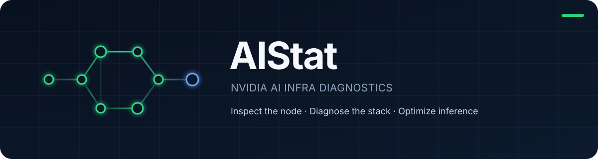

<div align="center">
  

  <p><strong>一条命令，看懂一台陌生的 NVIDIA 服务器。</strong></p>
  <p>面向大模型部署与高性能推理的只读检查、诊断和优化建议工具。</p>

  <p>
    <a href="https://github.com/arpingblue/AIStat/releases/latest"></a>
    <a href="https://github.com/arpingblue/AIStat/actions/workflows/ci.yml"></a>
    <a href="LICENSE"></a>
    
    
  </p>

  <p><a href="README.md">English</a> · <a href="#安装">安装</a> · <a href="#命令">命令</a> · <a href="docs/architecture.md">架构</a> · <a href="docs/rules.md">规则</a></p>
</div>

---

AIStat 是一个面向 Linux NVIDIA 节点的 AI Infra 检查与诊断工具。它把硬件拓扑、CUDA 软件栈、容器和推理运行时连接到同一份运维报告里，让部署阻塞与性能风险在变成事故之前就能被看到。

它不是 `nvidia-smi` 的又一层包装。AIStat 当前版本是一个只读基础层，最终目标是把 GPU 服务器上的事实转化为一套可验证的大模型部署与推理优化工作流。

```text
检查  →  建模  →  诊断  →  建议  →  验证  →  优化
```

## 看到整台节点，而不是一堆查询命令

SSH 登录服务器后，直接运行 `aistat`：

```text
AIStat 0.1.0 — Node Status

Hardware
  GPUs       AVAILABLE 4 × NVIDIA L20
  CPU        AVAILABLE 2 sockets, 96 cores, 192 logical
  Memory     AVAILABLE 1007.4 GiB
  NUMA       AVAILABLE 2 nodes

NVIDIA Stack
  Driver     PASS      580.159.03
  CUDA       AVAILABLE driver capability 13.0; selected toolkit 13.0
  Xid log    PERMISSION DENIED kernel log could not be fully inspected

Containers
  Client     AVAILABLE docker 29.5.2
  Daemon     AVAILABLE 29.5.2
  NVIDIA CTK AVAILABLE 1.19.0

AI Runtimes
  PyTorch    installed=AVAILABLE running=NOT DETECTED instances=0
  vLLM       installed=AVAILABLE running=NOT DETECTED instances=0
  SGLang     installed=NOT DETECTED running=NOT DETECTED instances=0

Readiness
  Deployment  READY
  Performance UNKNOWN — runtime workload evidence is not available
```

AIStat会保守地描述结果：查不到就是查不到，权限不足就是权限不足，绝不会把缺失证据伪装成PASS。

## AIStat把哪些东西连接起来

| 层级 | 检查内容 |
|---|---|
| **硬件** | CPU、内存、NUMA、PCIe、GPU、NIC/RDMA、存储 |
| **NVIDIA软件栈** | 驱动、CUDA能力与Toolkit、NCCL、Xid可见性 |
| **容器** | Docker客户端/daemon、NVIDIA Container Toolkit、runtime/CDI、GPU请求 |
| **AI运行时** | PyTorch、vLLM、SGLang安装位置和活跃进程上下文 |
| **拓扑** | GPU↔GPU P2P、GPU↔NUMA、GPU↔NIC/RDMA位置关系 |
| **诊断** | 部署就绪度、性能就绪度、25条基于证据的规则 |

它主要回答这些问题：

- 这台机器现在能不能部署GPU推理服务？
- 驱动、CUDA和运行时是否能够正确配合？
- Docker是没安装、daemon没启动，还是当前用户没有权限？
- NVIDIA Container Toolkit是否安装并配置完成？
- PyTorch、vLLM、SGLang安装在哪里，当前有没有运行？
- GPU和网卡是否跨NUMA放置？
- 哪些问题已经确认，哪些只是检查盲区？

## 安装

### 只安装到当前用户

不需要root。安装器会验证Release校验和，只写入 `~/.local/bin`：

```bash
mkdir -p "$HOME/.local/bin"
curl -fsSL https://raw.githubusercontent.com/arpingblue/AIStat/v0.1.0/scripts/install.sh | \
  AISTAT_VERSION=v0.1.0 AISTAT_INSTALL_DIR="$HOME/.local/bin" sh
export PATH="$HOME/.local/bin:$PATH"
aistat version
```

如果重新登录后找不到命令，把路径永久写入Shell配置：

```bash
printf '\nexport PATH="$HOME/.local/bin:$PATH"\n' >> "$HOME/.bashrc"
```

### 手动安装

前往[最新Release](https://github.com/arpingblue/AIStat/releases/latest)，下载 `linux-amd64` 或 `linux-arm64` 压缩包，用 `checksums.txt` 校验后解压，把 `aistat` 放到 `PATH`中的目录即可。

AIStat是一个静态链接的单二进制程序。正常检查不访问网络、不安装软件包、不启动服务，也不修改服务器配置。

## 命令

| 命令 | 用途 |
|---|---|
| `aistat` / `aistat status` | 运维总览和首要处理建议 |
| `aistat check` | 详细Finding、证据、影响、建议与验证方法 |
| `aistat info` | 节点硬件资产清单 |
| `aistat stack` | NVIDIA、CUDA、Docker和Container Toolkit状态 |
| `aistat runtime` | PyTorch、vLLM、SGLang安装与运行实例 |
| `aistat topology` | NUMA/GPU/NIC紧凑拓扑树和GPU P2P矩阵 |
| `aistat explain RULE_ID` | 解释一条诊断规则 |
| `aistat version` | 构建版本、Commit和时间 |

常用示例：

```bash
# 快速查看当前节点
aistat

# 保存完整JSON报告
aistat check --format json > aistat-report.json

# 详细诊断，WARN也让CI失败
aistat check --profile llm-inference --fail-on warn

# 查看GPU与物理网卡/RDMA的亲和性
aistat topology --view gpu-nic

# 解释一条规则
aistat explain CTR002
```

颜色只会在交互终端自动启用。JSON、重定向输出、`--no-color` 和 `NO_COLOR` 都不会包含ANSI控制字符。

## 为可靠诊断而设计

**先有证据，再下结论。** 每项事实区分 `available`、`not_detected`、`unsupported`、`permission_denied`、`timeout`、`parse_error`和 `unknown`，检查缺口不会被隐藏。

**默认只读。** AIStat不会调整sysctl、修改驱动、把用户加入Docker组、启动容器、执行benchmark或写入配置。

**所有采集都有边界。** 外部命令使用固定白名单，不调用Shell，并具有超时、输出限制和进程树清理。

**发现运行时，但不执行运行时。** 安装扫描只读取有界的软件包元数据，不会 `import vllm`、扫描其他用户HOME、调用 `docker exec` 或启动工作负载。

**只有一份标准报告。** 人类界面都来自同一个版本化JSON模型，其契约由 [0.1 JSON Schema](docs/schema/report-v0.1.schema.json)定义。

## 运维人员能看懂的拓扑

```text
Host
├── NUMA 0  CPUs 0-47,96-143
│   ├── GPU0  NVIDIA L20  0000:3b:00.0
│   └── NIC   mlx5_0 / ens6f0  0000:41:00.0
└── NUMA 1  CPUs 48-95,144-191
    ├── GPU2  NVIDIA L20  0000:9a:00.0
    └── NIC   mlx5_2 / ens12f0 0000:a1:00.0

GPU P2P
      GPU0 GPU1 GPU2 GPU3
GPU0   —   PIX  SYS  SYS
GPU1  PIX   —   SYS  SYS
GPU2  SYS  SYS   —   PIX
GPU3  SYS  SYS  PIX   —
```

默认人类界面保持紧凑；完整CPU、进程、PCIe和拓扑图仍保留在JSON中，供程序进一步分析。

## v0.1.0的边界

首个正式版本支持 Linux `amd64`和 `arm64`、NVIDIA GPU、Docker/NVIDIA Container Toolkit，以及单节点上的PyTorch、vLLM、SGLang尽力发现。

它现在是诊断基础层，还不是benchmark套件、性能Profiler、监控Daemon、Kubernetes/Slurm资产系统或自动调优引擎。没有活跃工作负载或时间序列证据时，Performance Readiness可以保持 `UNKNOWN`，但报告必须解释原因。

测试环境和当前限制见[验证记录](docs/validation.md)。

## 路线图

- **v0.2 — Verify：** 对比优化前后的报告，验证调整是否真正有效。
- **v0.3 — Observe：** 对GPU、PCIe、NVLink、NUMA、CPU压力和RDMA进行有界短时采样。
- **v0.4 — Diagnose inference：** 把vLLM/SGLang/PyTorch的放置和并行配置与性能证据关联起来。
- **后续：** 可选DCGM/eBPF适配器、受控benchmark、离线HTML报告和只读MCP接口。

AIStat的长期方向不变：**看懂节点、诊断全栈、优化推理链路，然后证明优化确实有效。**

## 构建与贡献

AIStat使用Go 1.26.5：

```bash
git clone https://github.com/arpingblue/AIStat.git
cd AIStat
go test ./...
CGO_ENABLED=0 go build -trimpath -o aistat ./cmd/aistat
```

参与开发前请阅读 [CONTRIBUTING.md](CONTRIBUTING.md)、[架构](docs/architecture.md)、[采集器约定](docs/collectors.md)、[规则目录](docs/rules.md)和[安全模型](docs/security.md)。

## 开源许可

AIStat使用 [Apache License 2.0](LICENSE)。
